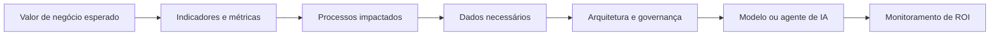
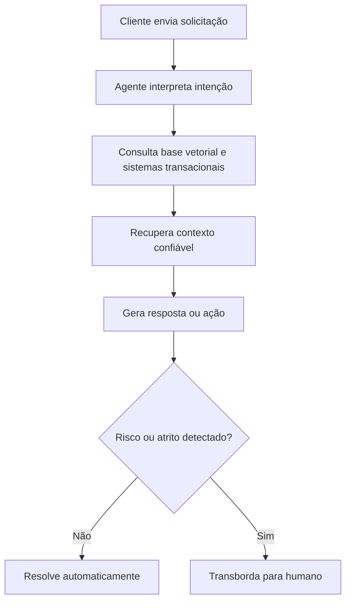

# Blueprint Executivo: AI Business Strategy e o Caso Quantum Commerce

Este documento consolida os principais aprendizados das aulas de **AI Business Strategy**, conectando fundamentos de adoção tecnológica, estratégia corporativa, arquitetura de dados, IA agêntica, governança, letramento organizacional e gestão de mudança.

O fio condutor é o caso **Quantum Commerce**, uma varejista digital omnicanal que precisa transformar sua operação fragmentada em uma organização orientada por dados, automação inteligente e agentes de IA capazes de executar processos de ponta a ponta.

---

## Sumário

- [Blueprint Executivo: AI Business Strategy e o Caso Quantum Commerce](#blueprint-executivo-ai-business-strategy-e-o-caso-quantum-commerce)
  - [Sumário](#sumário)
  - [1. Cenário de Mercado e o Paradoxo da GenAI](#1-cenário-de-mercado-e-o-paradoxo-da-genai)
    - [1.1. O Abismo da Execução](#11-o-abismo-da-execução)
    - [1.2. A Culpa Não é do Algoritmo](#12-a-culpa-não-é-do-algoritmo)
    - [1.3. A Tríade do Bloqueio Operacional](#13-a-tríade-do-bloqueio-operacional)
  - [2. Fundamentos da Estratégia de IA](#2-fundamentos-da-estratégia-de-ia)
    - [2.1. Estratégia para IA vs. Estratégia com IA](#21-estratégia-para-ia-vs-estratégia-com-ia)
    - [2.2. O Quadrante dos Vencedores](#22-o-quadrante-dos-vencedores)
    - [2.3. Engenharia Reversa do ROI](#23-engenharia-reversa-do-roi)
  - [3. O Desafio Complexo da Quantum Commerce](#3-o-desafio-complexo-da-quantum-commerce)
    - [3.1. Perfil da Empresa](#31-perfil-da-empresa)
    - [3.2. Barreiras Críticas de Crescimento](#32-barreiras-críticas-de-crescimento)
      - [3.2.1. O Muro da Escalabilidade](#321-o-muro-da-escalabilidade)
      - [3.2.2. A Competição por Fricção Zero](#322-a-competição-por-fricção-zero)
      - [3.2.3. Silos e Fragmentação de Dados](#323-silos-e-fragmentação-de-dados)
      - [3.2.4. Complexidade Internacional](#324-complexidade-internacional)
    - [3.3. Mandato Executivo](#33-mandato-executivo)
  - [4. Arquitetura de Soluções e Abordagem Agêntica](#4-arquitetura-de-soluções-e-abordagem-agêntica)
    - [4.1. Data Mesh e Centralização Semântica](#41-data-mesh-e-centralização-semântica)
    - [4.2. Suporte Agêntico com RAG](#42-suporte-agêntico-com-rag)
    - [4.3. Protocolo Human-in-the-Loop 80/20](#43-protocolo-human-in-the-loop-8020)
    - [4.4. Logística e Marketing Preditivos](#44-logística-e-marketing-preditivos)
      - [Logística preditiva](#logística-preditiva)
      - [Marketing preditivo](#marketing-preditivo)
  - [5. Cultura, Governança e Letramento](#5-cultura-governança-e-letramento)
    - [5.1. Mitigação de Shadow AI](#51-mitigação-de-shadow-ai)
    - [5.2. Governança, Guardrails e Compliance](#52-governança-guardrails-e-compliance)
    - [5.3. Estrutura Organizacional de Apoio](#53-estrutura-organizacional-de-apoio)
    - [5.4. Trilha de Letramento em IA](#54-trilha-de-letramento-em-ia)
  - [6. Planejamento Tático e Horizontes de Execução](#6-planejamento-tático-e-horizontes-de-execução)
    - [6.1. Horizonte 1 — Fundação](#61-horizonte-1--fundação)
    - [6.2. Horizonte 2 — Automatização Operacional](#62-horizonte-2--automatização-operacional)
    - [6.3. Horizonte 3 — Consolidação e Predição](#63-horizonte-3--consolidação-e-predição)
  - [7. Síntese Executiva](#7-síntese-executiva)

---

## 1. Cenário de Mercado e o Paradoxo da GenAI

O mercado corporativo vive um ciclo de forte expectativa em torno da **IA Generativa**, com projeções de contribuição econômica anual na casa de **US$ 2,6 a 4,4 trilhões**.

A contradição central é que o potencial econômico é elevado, mas a capacidade de execução das organizações ainda é limitada. Surge, assim, o **Paradoxo da GenAI**: muita intenção, muito investimento e pouco retorno capturado.

### 1.1. O Abismo da Execução

Embora grande parte das empresas planeje aumentar seus orçamentos em IA, a maioria dos projetos ainda não entrega o **ROI esperado**.

| Indicador | Leitura executiva |
|---|---|
| **92% das empresas** pretendem aumentar investimentos em IA | Há apetite corporativo e pressão competitiva. |
| **95% das organizações** relatam dificuldade em capturar ROI | A execução é o principal gargalo. |
| **42% das empresas** já abandonaram parte relevante das iniciativas | O entusiasmo inicial não sustenta projetos sem valor mensurável. |

> **Diagnóstico:** o problema não está apenas na tecnologia. Está na ausência de estratégia, dados preparados, governança, liderança e gestão de mudança.

### 1.2. A Culpa Não é do Algoritmo

Estudos discutidos em aula indicam que **84% das falhas em iniciativas de IA têm origem em decisões de liderança**.

Os erros mais frequentes são:

- iniciar projetos sem métricas claras de valor;
- tratar IA como experimento tecnológico, e não como transformação de negócio;
- abandonar o patrocínio executivo após a fase piloto;
- negligenciar dados, processos e cultura;
- superestimar a capacidade do modelo e subestimar a complexidade organizacional.

> **Conceito-chave:** a IA não corrige uma estratégia ruim. Ela amplifica a qualidade — ou a fragilidade — da organização que a implementa.

### 1.3. A Tríade do Bloqueio Operacional

A implementação de IA esbarra em três gargalos estruturais.

| Gargalo | Peso citado | Impacto prático |
|---|---:|---|
| **Dados** | 43% | Bases incompletas, inconsistentes, não integradas ou sem governança. |
| **Tecnologia** | 43% | Sistemas legados, baixa interoperabilidade e arquitetura pouco escalável. |
| **Pessoas** | 35% | Falta de letramento digital, resistência cultural e baixa fluência em IA. |

Esses três fatores impedem que a IA saia do laboratório e se torne capacidade operacional de escala.

[Voltar ao sumário](#sumario)

---

## 2. Fundamentos da Estratégia de IA

Uma estratégia de IA madura precisa separar claramente infraestrutura, ambição de negócio, métricas de valor e modelo operacional.

### 2.1. Estratégia para IA vs. Estratégia com IA

A empresa precisa operar com **ambidestria organizacional**: preparar a casa para usar IA e, ao mesmo tempo, redesenhar o negócio com IA.

| Dimensão | Foco | Exemplos |
|---|---|---|
| **Estratégia para IA** | Preparar a organização | Dados, governança, capacitação, segurança, arquitetura, cultura. |
| **Estratégia com IA** | Transformar o negócio | Novos produtos, novos serviços, automação agêntica, AI by Design. |

A primeira dimensão cria as condições de possibilidade. A segunda captura valor competitivo.

### 2.2. O Quadrante dos Vencedores

Soluções genéricas, como o modelo de **“copiloto para todos”**, tendem a falhar quando não estão vinculadas a processos críticos e dados proprietários.

O padrão de maior sucesso aparece quando a IA é aplicada em:

1. **Back-office estratégico**;
2. **processos fundamentais da operação**;
3. **dados proprietários de alta relevância**;
4. **métricas claras de eficiência, receita, risco ou experiência do cliente**.

> **Tese:** a vantagem competitiva em IA não vem do acesso ao mesmo modelo fundacional usado por todos. Vem da combinação entre dados proprietários, contexto operacional e redesenho de processos.

### 2.3. Engenharia Reversa do ROI

A adoção bem-sucedida de IA não começa pelo modelo. Começa pelo valor de negócio desejado.

A recomendação executiva é alocar **50% a 70% do orçamento** em prontidão, integração, limpeza e governança de dados antes de investir pesadamente em modelagem.

[Voltar ao sumário](#sumario)

---

## 3. O Desafio Complexo da Quantum Commerce

A **Quantum Commerce** representa uma empresa digital que atingiu escala, mas passou a enfrentar limites estruturais de operação, dados e atendimento.

### 3.1. Perfil da Empresa

| Atributo | Descrição |
|---|---|
| Modelo de negócio | Varejista digital omnicanal |
| Presença geográfica | 12 países |
| Catálogo | Mais de 5 milhões de SKUs |
| Operação atual | Scripts, RPAs, humanos e automações pontuais |
| Ambição | Tornar-se uma entidade agêntica |

### 3.2. Barreiras Críticas de Crescimento

A Quantum enfrenta quatro barreiras principais.

#### 3.2.1. O Muro da Escalabilidade

O modelo operacional baseado em scripts, RPAs e intervenção humana tornou-se insuficiente para controlar custos de logística, personalização de marketing e suporte ao cliente.

#### 3.2.2. A Competição por Fricção Zero

A empresa já não compete apenas por preço. O consumidor exige:

- resolução instantânea;
- respostas contextualizadas;
- rastreamento em tempo real;
- personalização;
- consistência entre canais.

Nesse contexto, chatbots baseados em FAQ e mecanismos de busca rígidos tornam-se obsoletos.

#### 3.2.3. Silos e Fragmentação de Dados

O problema raiz é a falta de integração entre sistemas.

| Silo | Consequência |
|---|---|
| Estoque sem conexão com suporte | Atendimento informa prazos ou disponibilidade incorretos. |
| Políticas de devolução inconsistentes | Experiência irregular entre países, canais ou categorias. |
| Histórico do cliente fragmentado | Baixa personalização e perda de contexto. |
| Sistemas logísticos isolados | Baixa capacidade de previsão e roteirização inteligente. |

#### 3.2.4. Complexidade Internacional

A presença em 12 países aumenta a complexidade regulatória, logística, tributária, linguística e operacional.

### 3.3. Mandato Executivo

O mandato estratégico é transformar a Quantum em uma **entidade agêntica**.

Isso significa que a IA deve deixar de ser apenas um motor de respostas e passar a executar processos de ponta a ponta, com supervisão, governança e capacidade de intervenção humana quando necessário.

> **Objetivo:** sair de automações isoladas para uma arquitetura em que agentes de IA compreendam contexto, consultem dados confiáveis, tomem decisões dentro de limites definidos e executem ações mensuráveis.

[Voltar ao sumário](#sumario)

---

## 4. Arquitetura de Soluções e Abordagem Agêntica

A solução para a Quantum exige uma arquitetura que combine dados governados, integração sistêmica, agentes cognitivos e mecanismos de controle.

### 4.1. Data Mesh e Centralização Semântica

A premissa inicial é quebrar silos informacionais por meio de uma arquitetura de **Data Mesh**, na qual os domínios de negócio passam a ser responsáveis por seus próprios produtos de dados.

| Elemento | Função |
|---|---|
| **ERP** | Pedidos, faturamento, clientes e transações. |
| **WMS** | Armazém, separação, expedição e inventário. |
| **Sistemas de estoque** | Disponibilidade e reposição. |
| **CRM e atendimento** | Histórico do cliente, interações e tickets. |
| **APIs padronizadas** | Integração entre domínios e consumo por agentes. |
| **Camada semântica** | Padronização de conceitos, regras e vocabulário de negócio. |

O Data Mesh permite descentralização operacional com governança federada. Cada domínio mantém responsabilidade sobre seus dados, mas todos seguem padrões comuns de qualidade, segurança, documentação e interoperabilidade.

### 4.2. Suporte Agêntico com RAG

O suporte ao cliente deve migrar de bots baseados em FAQ para agentes com **RAG — Retrieval-Augmented Generation**.

Esse modelo combina geração de linguagem natural com busca em bases confiáveis, como:

- políticas comerciais;
- regras de troca e devolução;
- status de pedido;
- rastreamento logístico;
- histórico do cliente;
- base de conhecimento interna;
- documentação regulatória por país.

O ganho não está apenas em responder melhor. Está em transformar atendimento em execução: consultar, comparar, decidir, registrar e acionar fluxos.

### 4.3. Protocolo Human-in-the-Loop 80/20

A IA Generativa é probabilística e sujeita a alucinações. Por isso, a Quantum não deve tratá-la como solução autônoma irrestrita.

A meta operacional proposta é:

| Tipo de atendimento | Meta |
|---|---:|
| Resolução autônoma por IA | 80% |
| Intervenção humana | 20% |

Os agentes devem fazer triagem de:

- contexto;
- intenção;
- sentimento;
- risco jurídico;
- potencial insatisfação;
- complexidade operacional;
- exceções comerciais.

Quando detectarem atrito, risco ou incerteza, devem pausar a automação e transferir o caso para atendimento humano.

> **Princípio:** automação eficiente não é automação sem controle. É automação com critérios claros de transbordo, auditoria e responsabilidade.

### 4.4. Logística e Marketing Preditivos

A arquitetura agêntica também deve atuar em logística e marketing.

#### Logística preditiva

Agentes podem analisar telemetria em tempo real para:

- prever atrasos;
- otimizar rotas;
- reduzir custo de última milha;
- priorizar entregas críticas;
- replanejar operações diante de falhas.

#### Marketing preditivo

Agentes podem hiperpersonalizar a jornada para:

- reduzir abandono de carrinho;
- recomendar produtos com base em intenção e histórico;
- ajustar campanhas por segmento;
- ativar ofertas no momento adequado;
- melhorar conversão sem degradar margem.

[Voltar ao sumário](#sumario)

---

## 5. Cultura, Governança e Letramento

A implementação de IA é menos um projeto tecnológico e mais uma transformação organizacional. Pessoas, controles e clareza de papéis são determinantes.

### 5.1. Mitigação de Shadow AI

**Shadow AI** é o uso não homologado de ferramentas de IA em ambiente corporativo, especialmente quando colaboradores inserem dados sensíveis, documentos internos ou informações de clientes em ferramentas não aprovadas.

| Risco | Consequência |
|---|---|
| Vazamento de dados | Exposição de informações sensíveis ou estratégicas. |
| Perda de propriedade intelectual | Uso indevido de documentos, códigos, estratégias ou bases internas. |
| Falta de rastreabilidade | Impossibilidade de auditar decisões ou outputs. |
| Inconsistência operacional | Cada área cria seus próprios padrões e riscos. |

A mitigação exige:

- diretrizes oficiais de uso;
- manifesto ou política corporativa de IA;
- ambientes seguros de experimentação;
- ferramentas homologadas;
- treinamento contínuo;
- monitoramento de uso.

### 5.2. Governança, Guardrails e Compliance

A estratégia de IA precisa incorporar auditoria, controles e regras desde o desenho da solução.

| Camada de controle | Função |
|---|---|
| **Guardrails de linguagem** | Prevenir respostas inadequadas, discriminatórias ou fora da política. |
| **Guardrails operacionais** | Limitar ações que agentes podem executar. |
| **Auditoria contínua** | Registrar decisões, fontes, logs e eventos críticos. |
| **Compliance regulatório** | Alinhar operações a LGPD, GDPR, AI Act e normas setoriais. |
| **Gestão de risco** | Classificar casos por impacto, probabilidade e criticidade. |

> **Regra executiva:** quanto maior a autonomia do agente, maior deve ser a robustez da governança.

### 5.3. Estrutura Organizacional de Apoio

A Quantum deve criar uma rede formal de governança e adoção de IA.

| Papel | Responsabilidade |
|---|---|
| **CAIO — Chief AI Officer** | Liderar estratégia, governança, valor e adoção de IA. |
| **CoE — Centro de Excelência em IA** | Definir padrões, metodologias, arquitetura, priorização e boas práticas. |
| **AI Champions** | Atuar como multiplicadores dentro das unidades de negócio. |
| **Jurídico e Compliance** | Avaliar riscos regulatórios, contratos, privacidade e responsabilidade. |
| **TI, Dados e Segurança** | Garantir arquitetura, integração, observabilidade e proteção. |
| **Áreas de negócio** | Identificar casos de uso, medir valor e operar mudanças. |

Essa estrutura evita que a IA fique isolada em TI ou pulverizada sem controle nas áreas de negócio.

### 5.4. Trilha de Letramento em IA

A capacitação corporativa deve ser segmentada por nível de profundidade e responsabilidade.

| Nível | Público | Conteúdo |
|---|---|---|
| **Nível 1 — Geral** | Todos os funcionários | Introdução à IA, ética, segurança de dados, riscos e boas práticas. |
| **Nível 2 — Negócios** | Marketing, RH, atendimento, finanças, operações | Ferramentas de IA, low-code, engenharia de prompt, redesenho de processos e métricas de valor. |
| **Nível 3 — Engenharia** | Desenvolvedores, dados, arquitetura e especialistas | RAG avançado, integração de sistemas, multiagentes, observabilidade, avaliação e segurança. |

> **Síntese:** letramento em IA não é treinamento pontual. É infraestrutura cultural para uso responsável, produtivo e escalável.

[Voltar ao sumário](#sumario)

---

## 6. Planejamento Tático e Horizontes de Execução

Para alcançar o nível de maturidade de uma verdadeira **entidade agêntica**, a Quantum precisa executar a transformação em horizontes progressivos, com OKRs claros e métricas de valor.

### 6.1. Horizonte 1 — Fundação

**Prazo:** 0 a 6 meses
**Foco:** preparar dados, processos, governança e pessoas.

Principais iniciativas:

- redesenhar processos críticos;
- mapear sistemas, dados e silos;
- iniciar arquitetura de Data Mesh;
- definir políticas de IA e uso seguro;
- criar estrutura de governança;
- iniciar letramento corporativo;
- implementar ferramentas assistivas, como Microsoft Copilot ou Gemini, para ganhos básicos de produtividade.

| OKR sugerido | Indicador |
|---|---|
| Elevar prontidão organizacional para IA | % de áreas com dados mapeados e responsáveis definidos |
| Reduzir risco de Shadow AI | % de colaboradores treinados e ferramentas homologadas |
| Criar base de governança | Comitê, política, guardrails e catálogo inicial de casos de uso |

### 6.2. Horizonte 2 — Automatização Operacional

**Prazo:** 6 a 18 meses
**Foco:** automatizar processos repetitivos e integrar agentes ao fluxo operacional.

Principais iniciativas:

- implementar agentes conversacionais com RAG;
- integrar suporte, estoque, pedidos e logística;
- criar mecanismos de transbordo humano;
- definir KPIs de deflexão e qualidade;
- monitorar alucinações, erros e satisfação;
- iniciar automações em logística e marketing.

| OKR sugerido | Indicador |
|---|---|
| Aumentar resolução autônoma no suporte | % de chamados resolvidos sem intervenção humana |
| Reduzir tempo médio de resposta | TMA e SLA por canal |
| Melhorar experiência do cliente | CSAT, NPS, reclamações e reincidência |

### 6.3. Horizonte 3 — Consolidação e Predição

**Prazo:** 18 a 36 meses
**Foco:** consolidar IA como capacidade estratégica e preditiva do negócio.

Principais iniciativas:

- implementar modelos preditivos ponta a ponta;
- operar agentes em cadeias logísticas globais;
- personalizar jornadas em tempo real;
- automatizar decisões com controle e auditoria;
- expandir IA para planejamento, pricing, sortimento e supply chain;
- evoluir para maturidade agêntica de Nível 5.

| OKR sugerido | Indicador |
|---|---|
| Consolidar IA como capacidade estratégica | % de processos críticos assistidos ou executados por agentes |
| Reduzir custo operacional | Custo por atendimento, entrega ou pedido |
| Aumentar conversão e retenção | Conversão, recompra, abandono de carrinho e margem |

[Voltar ao sumário](#sumario)

---

## 7. Síntese Executiva

A principal conclusão das aulas de **AI Business Strategy** é que a vantagem competitiva em IA não nasce da simples adoção de modelos generativos. Ela nasce da combinação entre estratégia, dados proprietários, processos redesenhados, governança, cultura e mensuração de valor.

No caso **Quantum Commerce**, a transformação em entidade agêntica exige três movimentos coordenados:

1. **Fundação:** dados integrados, arquitetura governada, letramento e políticas de IA.
2. **Automação:** agentes com RAG, transbordo humano e métricas de eficiência operacional.
3. **Predição:** IA aplicada à logística, marketing, personalização e decisões de negócio em tempo real.

> **Conclusão:** a IA não deve ser tratada como ferramenta isolada, mas como nova camada operacional da empresa. O desafio executivo é transformar experimentos em capacidades permanentes, com ROI, responsabilidade e escala.

[Voltar ao sumário](#sumario)
