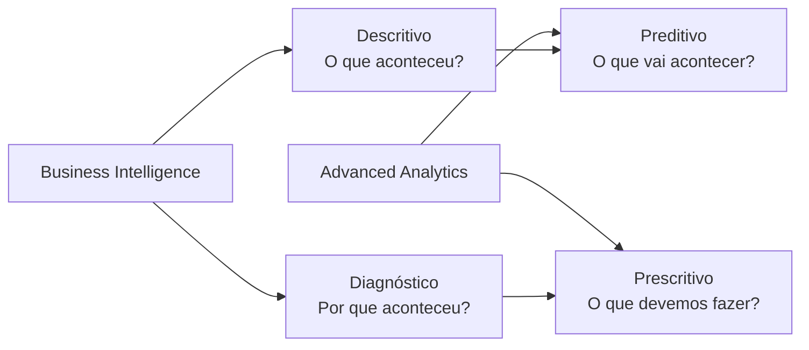
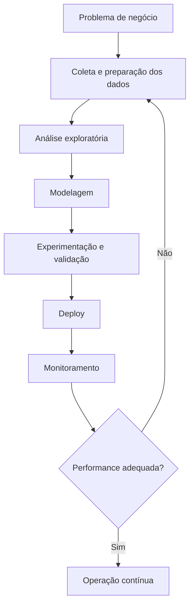

# AI Foundations & Learning Models

> **Objetivo do documento:** consolidar os principais conceitos da disciplina **AI Foundations & Learning Models**, conectando fundamentos matemáticos, lógica de negócio, práticas de implementação e leitura estratégica de modelos de Inteligência Artificial.

---

## Sumário

- [AI Foundations \& Learning Models](#ai-foundations--learning-models)
  - [Sumário](#sumário)
  - [1. Visão Geral da Disciplina](#1-visão-geral-da-disciplina)
  - [2. Fundamentos de Machine Learning e Analytics](#2-fundamentos-de-machine-learning-e-analytics)
    - [2.1. Definição clássica de Machine Learning](#21-definição-clássica-de-machine-learning)
    - [2.2. Evolução de Analytics](#22-evolução-de-analytics)
    - [2.3. Fluxo de um projeto de dados](#23-fluxo-de-um-projeto-de-dados)
    - [2.4. Papéis em projetos de IA e dados](#24-papéis-em-projetos-de-ia-e-dados)
  - [3. Underfitting, Overfitting e Generalização](#3-underfitting-overfitting-e-generalização)
    - [3.1. Trade-off entre viés e variância](#31-trade-off-entre-viés-e-variância)
    - [3.2. Comparação entre underfitting e overfitting](#32-comparação-entre-underfitting-e-overfitting)
      - [Underfitting](#underfitting)
      - [Overfitting](#overfitting)
  - [4. Regressão Linear e Otimização](#4-regressão-linear-e-otimização)
    - [4.1. Objetivo da regressão linear](#41-objetivo-da-regressão-linear)
    - [4.2. Função de custo: MSE](#42-função-de-custo-mse)
    - [4.3. Gradiente descendente](#43-gradiente-descendente)
    - [4.4. Equação normal](#44-equação-normal)
    - [4.5. Gradiente descendente vs. equação normal](#45-gradiente-descendente-vs-equação-normal)
  - [5. Support Vector Machines — SVM](#5-support-vector-machines--svm)
    - [5.1. Conceito central](#51-conceito-central)
    - [5.2. Hard margin vs. soft margin](#52-hard-margin-vs-soft-margin)
      - [Hard margin](#hard-margin)
      - [Soft margin](#soft-margin)
    - [5.3. Support vectors](#53-support-vectors)
    - [5.4. Kernel trick](#54-kernel-trick)
    - [5.5. Normalização](#55-normalização)
  - [6. Transfer Learning e Fine-Tuning](#6-transfer-learning-e-fine-tuning)
    - [6.1. Conceito de transfer learning](#61-conceito-de-transfer-learning)
    - [6.2. Checklist de implementação](#62-checklist-de-implementação)
      - [Etapa 1 — Preparação](#etapa-1--preparação)
      - [Etapa 2 — Setup](#etapa-2--setup)
      - [Etapa 3 — Fase 1: treinamento do head](#etapa-3--fase-1-treinamento-do-head)
  - [7. Mapas Mentais e Diagramas](#7-mapas-mentais-e-diagramas)
    - [7.1. Evolução de Analytics](#71-evolução-de-analytics)
    - [7.2. Ciclo de vida de um projeto de Machine Learning](#72-ciclo-de-vida-de-um-projeto-de-machine-learning)
  - [8. Síntese Executiva](#8-síntese-executiva)
  - [9. Glossário Essencial](#9-glossário-essencial)

---

## 1. Visão Geral da Disciplina

A disciplina **AI Foundations & Learning Models** percorre o ciclo de vida dos dados até a implementação de modelos complexos de Inteligência Artificial. O conteúdo combina três dimensões complementares:

| Dimensão | Foco | Aplicação prática |
| :--- | :--- | :--- |
| **Fundamentação teórica** | Conceitos estruturantes de ML, analytics, regressão, SVM e generalização | Entender o funcionamento dos modelos antes da aplicação |
| **Intuição matemática** | Funções de custo, otimização, hiperplanos, kernels e parâmetros | Avaliar por que um modelo aprende, erra ou generaliza |
| **Implementação aplicada** | Projetos de dados, papéis técnicos, fine-tuning e métricas | Traduzir modelos para problemas reais de negócio |

> **Ideia central:** Machine Learning não é apenas escolher algoritmos. É desenhar uma cadeia completa de aprendizado, validação, otimização, implementação e monitoramento.

[Voltar ao sumário](#sumário)

---

## 2. Fundamentos de Machine Learning e Analytics

### 2.1. Definição clássica de Machine Learning

O curso estabelece a diferença entre sistemas tradicionais e aprendizado de máquina a partir da definição clássica de **Tom Mitchell**:

> “Diz-se que um programa de computador aprende a partir da experiência **E**, em relação a uma classe de tarefas **T** e medida de desempenho **P**, se o seu desempenho em **T**, medido por **P**, melhora com a experiência **E**.”

Em termos executivos:

| Elemento | Significado | Exemplo |
| :--- | :--- | :--- |
| **Experiência — E** | Dados históricos usados para aprendizado | Histórico de vendas, cliques, imagens, transações |
| **Tarefa — T** | Problema que o modelo precisa executar | Classificar, prever, recomendar, detectar anomalias |
| **Performance — P** | Métrica usada para medir sucesso | Accuracy, F1-score, AUC, erro médio, lucro incremental |

> **Interpretação prática:** um modelo aprende quando melhora seu desempenho em uma tarefa mensurável a partir da exposição a dados.

[Voltar ao sumário](#sumário)

---

### 2.2. Evolução de Analytics

Para gerar valor ao negócio, a área de **Analytics** evolui em níveis de sofisticação. Cada nível responde a uma pergunta diferente e exige capacidades técnicas distintas.

| Categoria | Tipo de análise | Pergunta respondida | Exemplo de negócio |
| :--- | :--- | :--- | :--- |
| **Business Intelligence — BI** | **Descritivo** | O que aconteceu? | Como está a performance de vendas? |
| **Business Intelligence — BI** | **Diagnóstico** | Por que aconteceu? | O que causou o declínio nas vendas? |
| **Advanced Analytics — IA/ML** | **Preditivo** | O que vai acontecer? | Qual a previsão de vendas para o próximo trimestre? |
| **Advanced Analytics — IA/ML** | **Prescritivo** | O que devemos fazer? | Qual a melhor rota, oferta, próxima ação ou jogada? |

> **Leitura estratégica:** quanto mais avançado o nível analítico, maior o potencial de geração de valor, mas também maior a exigência de dados, governança, modelagem e capacidade de execução.

[Voltar ao sumário](#sumário)

---

### 2.3. Fluxo de um projeto de dados

Um projeto de dados não começa no algoritmo. Ele passa por uma sequência de etapas que conectam problema de negócio, dados, modelagem e operação.

| Etapa | Objetivo | Entregável típico |
| :--- | :--- | :--- |
| **Definição do problema** | Traduzir a dor de negócio em tarefa analítica | Hipótese, métrica de sucesso e escopo |
| **Coleta e preparação dos dados** | Organizar, limpar e estruturar a base | Dataset confiável e documentado |
| **Análise exploratória — EDA** | Entender padrões, outliers e relações | Visualizações, estatísticas e hipóteses |
| **Modelagem** | Treinar modelos candidatos | Baselines, modelos ajustados e métricas |
| **Experimentação** | Validar desempenho e robustez | Testes, validação cruzada e comparação de modelos |
| **Deploy** | Colocar o modelo em produção | API, pipeline, dashboard ou produto integrado |
| **Monitoramento** | Acompanhar performance após o uso real | Alertas, métricas e re-treinamento quando necessário |

> **Máxima da disciplina:** **algoritmos simples com muitos dados frequentemente superam algoritmos complexos com poucos dados**.

[Voltar ao sumário](#sumário)

---

### 2.4. Papéis em projetos de IA e dados

Projetos de IA exigem uma equipe multidisciplinar. O desempenho do modelo depende tanto da matemática quanto da engenharia, da interpretação de negócio e da capacidade de colocar a solução em produção.

| Papel | Responsabilidade principal | Contribuição para o projeto |
| :--- | :--- | :--- |
| **Data Scientist** | Modelagem estatística e ML | Seleciona algoritmos, treina modelos e avalia métricas |
| **Data Engineer** | Infraestrutura e pipelines de dados | Garante disponibilidade, qualidade e integração dos dados |
| **ML Engineer** | Operacionalização de modelos | Leva modelos para produção e estrutura MLOps |
| **Business Analyst** | Tradução do problema de negócio | Define contexto, métricas e critérios de valor |

[Voltar ao sumário](#sumário)

---

## 3. Underfitting, Overfitting e Generalização

Um dos principais desafios em Machine Learning é equilibrar a capacidade de aprendizado do modelo. O objetivo é capturar o padrão real dos dados sem simplificar demais e sem decorar ruído.

### 3.1. Trade-off entre viés e variância

| Conceito | Definição | Risco |
| :--- | :--- | :--- |
| **Viés — Bias** | Erro decorrente de hipóteses simplificadoras do modelo | Modelo simples demais, incapaz de capturar padrões relevantes |
| **Variância — Variance** | Sensibilidade excessiva às variações da base de treino | Modelo instável, que aprende ruído e perde generalização |
| **Generalização** | Capacidade de performar bem em dados novos | Métrica crítica para uso real do modelo |

> **Regra prática:** o objetivo não é maximizar o desempenho no treino. O objetivo é maximizar a capacidade de generalização em dados ainda não vistos.

[Voltar ao sumário](#sumário)

---

### 3.2. Comparação entre underfitting e overfitting

| Situação | O que acontece | Desempenho no treino | Desempenho no teste | Diagnóstico |
| :--- | :--- | :--- | :--- | :--- |
| **Underfitting** | Modelo simples demais | Ruim | Ruim | Alto viés |
| **Bom ajuste** | Modelo captura padrões relevantes | Bom | Bom | Equilíbrio entre viés e variância |
| **Overfitting** | Modelo decora os dados de treino, inclusive ruído | Muito bom | Ruim | Alta variância |

#### Underfitting

Ocorre quando o modelo é simples demais para capturar a complexidade dos dados. Ele erra tanto na base de treino quanto na base de teste.

#### Overfitting

Ocorre quando o modelo se **superespecializa** nos dados de treino. Ele aprende padrões específicos, exceções e ruídos estatísticos da base original. Como consequência, falha ao receber dados novos.

> **Leitura executiva:** overfitting é perigoso porque cria uma falsa sensação de performance. O modelo parece excelente no laboratório, mas falha na operação.

[Voltar ao sumário](#sumário)

---

## 4. Regressão Linear e Otimização

### 4.1. Objetivo da regressão linear

A **Regressão Linear** busca ajustar uma reta aos dados para estimar valores contínuos.

Exemplos típicos:

- prever lucro de uma loja com base no tamanho da população;
- estimar preço de imóveis;
- projetar demanda;
- antecipar receita;
- calcular impacto esperado de uma variável sobre outra.

A hipótese do modelo pode ser representada de forma simplificada como:

$$
h_\theta(x) = \theta_0 + \theta_1x
$$

Onde:

| Símbolo | Significado |
| :--- | :--- |
| $h_\theta(x)$ | Valor predito pelo modelo |
| $\theta_0$ | Intercepto da reta |
| $\theta_1$ | Peso ou coeficiente da variável explicativa |
| $x$ | Variável de entrada |

[Voltar ao sumário](#sumário)

---

### 4.2. Função de custo: MSE

Para determinar se a reta ajustada é boa, o modelo usa uma **função de custo**. A mais comum é o **MSE — Mean Squared Error**, ou **Erro Quadrático Médio**.

$$
MSE = \frac{1}{m}\sum_{i=1}^{m}(h_\theta(x_i) - y_i)^2
$$

| Componente | Interpretação |
| :--- | :--- |
| $h_\theta(x_i)$ | Valor predito pelo modelo para a observação $i$ |
| $y_i$ | Valor real observado |
| $h_\theta(x_i) - y_i$ | Erro da previsão |
| $(h_\theta(x_i) - y_i)^2$ | Erro elevado ao quadrado |
| $m$ | Número de observações |

O erro é elevado ao quadrado por duas razões principais:

1. evita o cancelamento entre erros positivos e negativos;
2. penaliza erros grandes de forma mais severa.

> **Exemplo interpretativo:** um MSE de 100.000 em uma previsão imobiliária indica que o erro médio quadrático do modelo é elevado e precisa ser interpretado em relação à escala monetária do problema.

[Voltar ao sumário](#sumário)

---

### 4.3. Gradiente descendente

O **Gradiente Descendente** é um método iterativo de otimização usado para encontrar os parâmetros $\theta$ que minimizam a função de custo.

A lógica é simples:

1. iniciar com parâmetros quaisquer;
2. calcular o erro;
3. medir a direção de maior crescimento do erro por meio do gradiente;
4. ajustar os parâmetros na direção oposta;
5. repetir até convergir.

A taxa de aprendizado é representada por $\alpha$.

| Valor de $\alpha$ | Consequência |
| :--- | :--- |
| Muito pequeno | Convergência lenta, com muitas iterações |
| Adequado | Caminho estável até o mínimo da função de custo |
| Muito grande | Pode saltar o mínimo global e não convergir |

> **Intuição:** o gradiente descendente funciona como descer uma montanha procurando o ponto mais baixo. O learning rate define o tamanho dos passos.

[Voltar ao sumário](#sumário)

---

### 4.4. Equação normal

A **Equação Normal** é uma alternativa analítica ao gradiente descendente. Em vez de ajustar os parâmetros iterativamente, ela calcula os pesos diretamente.

$$
\theta = (X^T X)^{-1}X^Ty
$$

| Elemento | Significado |
| :--- | :--- |
| $X$ | Matriz de características |
| $X^T$ | Transposta da matriz $X$ |
| $(X^TX)^{-1}$ | Inversa da matriz $X^TX$ |
| $y$ | Vetor de valores reais |
| $\theta$ | Vetor de parâmetros estimados |

A principal vantagem é que não exige escolha de $\alpha$ nem iterações. A limitação é o custo computacional quando o número de características é muito grande.

[Voltar ao sumário](#sumário)

---

### 4.5. Gradiente descendente vs. equação normal

| Critério | Gradiente descendente | Equação normal |
| :--- | :--- | :--- |
| Tipo de solução | Iterativa | Analítica |
| Exige learning rate? | Sim | Não |
| Exige iterações? | Sim | Não |
| Escala para muitas variáveis? | Melhor | Pior |
| Uso recomendado | Bases grandes e modelos com muitas características | Bases menores ou problemas simples |

> **Conclusão prática:** para bases muito grandes, o gradiente descendente tende a ser preferível. Para problemas menores, a equação normal pode ser mais direta.

[Voltar ao sumário](#sumário)

---

## 5. Support Vector Machines — SVM

### 5.1. Conceito central

O **Support Vector Machine — SVM** é um classificador discriminativo que busca separar classes por meio de um **hiperplano ótimo**.

O objetivo é encontrar a fronteira de decisão que maximize a margem entre as classes.

| Conceito | Significado |
| :--- | :--- |
| **Hiperplano** | Fronteira matemática que separa classes |
| **Margem** | Distância entre o hiperplano e os pontos mais próximos de cada classe |
| **Support vectors** | Pontos que definem a posição da margem |
| **Kernel** | Função usada para lidar com relações não lineares |

[Voltar ao sumário](#sumário)

---

### 5.2. Hard margin vs. soft margin

| Tipo de margem | Definição | Vantagem | Limitação |
| :--- | :--- | :--- | :--- |
| **Hard margin** | Tenta separar todos os dados perfeitamente | Boa quando os dados são linearmente separáveis | Muito sensível a outliers |
| **Soft margin** | Permite alguns erros de classificação | Mais robusta e generalizável | Exige calibragem entre margem e erro |

#### Hard margin

A **hard margin** tenta criar uma separação perfeita entre as classes. Funciona apenas quando os dados são linearmente separáveis e não apresentam outliers relevantes.

#### Soft margin

A **soft margin** permite alguns erros durante o treinamento. Essa flexibilidade ajuda o modelo a ignorar anomalias locais e construir uma fronteira mais robusta.

> **Leitura prática:** a soft margin geralmente é mais útil em problemas reais, porque dados corporativos raramente são limpos, perfeitamente separáveis e livres de anomalias.

[Voltar ao sumário](#sumário)

---

### 5.3. Support vectors

Os **support vectors** são as observações que ficam exatamente nas margens da fronteira de decisão. Eles são críticos porque determinam a posição do hiperplano.

Pontos adicionados fora da região de margem normalmente não alteram a fronteira do modelo.

> **Ideia-chave:** o SVM não depende igualmente de todos os dados. Ele depende principalmente dos pontos mais informativos, localizados próximos à fronteira de decisão.

[Voltar ao sumário](#sumário)

---

### 5.4. Kernel trick

Quando os dados não podem ser separados por uma reta, o SVM pode usar o **Kernel Trick** para representar relações não lineares em dimensões superiores.

Um exemplo é o **kernel polinomial**:

$$
k(x, y) = (x^Ty + c)^d
$$

| Parâmetro | Significado |
| :--- | :--- |
| $x$ e $y$ | Vetores de entrada |
| $x^Ty$ | Produto interno entre vetores |
| $c$ | Termo de ajuste da influência relativa dos componentes |
| $d$ | Grau do polinômio |

O kernel permite capturar padrões complexos sem transformar fisicamente toda a matriz de dados. Isso reduz custo computacional e amplia a capacidade do modelo.

> **Intuição:** o kernel cria uma nova perspectiva geométrica para os dados. Relações que não eram separáveis no espaço original podem se tornar separáveis em um espaço transformado.

[Voltar ao sumário](#sumário)

---

### 5.5. Normalização

Como o SVM avalia distâncias entre amostras e hiperplano, a escala das variáveis afeta diretamente o resultado.

| Problema | Consequência |
| :--- | :--- |
| Variáveis em escalas muito diferentes | Uma variável pode dominar artificialmente a fronteira |
| Ausência de normalização | Distâncias ficam distorcidas |
| Normalização adequada | O modelo compara atributos de forma mais equilibrada |

> **Regra prática:** normalizar os dados antes de aplicar SVM é uma etapa obrigatória para evitar falhas de classificação causadas por escala.

[Voltar ao sumário](#sumário)

---

## 6. Transfer Learning e Fine-Tuning

### 6.1. Conceito de transfer learning

**Transfer Learning** consiste em aproveitar modelos complexos já treinados em grandes bases e adaptá-los para um problema específico.

Essa abordagem é particularmente útil quando:

- o problema de negócio tem poucos dados disponíveis;
- existe um modelo pré-treinado em domínio semelhante;
- o custo de treinar um modelo do zero seria alto;
- a organização precisa reduzir tempo de implementação;
- há necessidade de aproveitar representações já aprendidas por redes neurais profundas.

O **Fine-Tuning** é o processo de ajuste fino desse modelo pré-treinado para o contexto específico do novo problema.

[Voltar ao sumário](#sumário)

---

### 6.2. Checklist de implementação

#### Etapa 1 — Preparação

Antes de treinar, é necessário avaliar o dataset e definir claramente a métrica de sucesso.

| Tarefa | Objetivo |
| :--- | :--- |
| Analisar tamanho do dataset | Entender se há dados suficientes para fine-tuning |
| Verificar distribuição das classes | Identificar desbalanceamentos |
| Definir métrica de sucesso | Escolher entre F1-score, Accuracy, AUC ou outra métrica adequada |
| Escolher modelo pré-treinado | Preferir modelos treinados em domínio semelhante |

#### Etapa 2 — Setup

Na configuração inicial, substitui-se a camada final da rede pelo classificador específico do novo problema.

| Componente | Ação |
| :--- | :--- |
| **Backbone** | Congelar inicialmente para preservar o aprendizado prévio |
| **Head** | Substituir pela nova camada final de classificação |
| **Métrica** | Conectar o treinamento ao critério de sucesso definido |
| **Validação** | Acompanhar queda da função de custo e desempenho em dados de validação |

#### Etapa 3 — Fase 1: treinamento do head

A primeira fase do fine-tuning treina apenas a nova camada final.

| Parâmetro | Recomendação apresentada |
| :--- | :--- |
| Camadas treinadas | Apenas o head |
| Backbone | Congelado |
| Número de épocas | Geralmente entre 3 e 10 |
| Limite prático | Fine-tuning raramente exige mais de 20 épocas |
| Learning rate | Entre `1e-3` e `1e-2` |
| Monitoramento | Validar queda da função de custo — loss |

> **Leitura prática:** treinar primeiro apenas o head reduz o risco de destruir representações úteis já aprendidas pelo modelo pré-treinado.

[Voltar ao sumário](#sumário)

---

## 7. Mapas Mentais e Diagramas

### 7.1. Evolução de Analytics

[Voltar ao sumário](#sumário)

---

### 7.2. Ciclo de vida de um projeto de Machine Learning

[Voltar ao sumário](#sumário)

---

## 8. Síntese Executiva

A disciplina demonstra que o valor de IA depende de uma combinação entre **dados**, **modelagem**, **métricas**, **governança técnica** e **clareza de problema**.

| Tema | Aprendizado central |
| :--- | :--- |
| **Machine Learning** | Modelos aprendem quando melhoram uma tarefa mensurável a partir da experiência |
| **Analytics** | A maturidade evolui do descritivo ao prescritivo |
| **Generalização** | O modelo precisa performar bem em dados novos, não apenas no treino |
| **Regressão Linear** | Permite prever valores contínuos a partir da minimização de erro |
| **Otimização** | Gradiente descendente e equação normal são caminhos diferentes para ajustar parâmetros |
| **SVM** | Classifica dados maximizando margens e usando kernels para relações não lineares |
| **Fine-Tuning** | Adapta modelos pré-treinados a problemas específicos de negócio |

> **Mensagem final:** bons modelos não nascem apenas de algoritmos sofisticados. Eles dependem de problemas bem formulados, dados confiáveis, métricas corretas, validação rigorosa e capacidade de implementação.

[Voltar ao sumário](#sumário)

---

## 9. Glossário Essencial

| Termo | Definição |
| :--- | :--- |
| **Accuracy** | Proporção de previsões corretas entre todas as previsões |
| **AUC** | Métrica que avalia a capacidade discriminatória de um classificador |
| **Backbone** | Parte principal de uma rede neural pré-treinada que extrai representações |
| **Bias** | Viés; erro por simplificação excessiva do modelo |
| **Deploy** | Etapa em que o modelo é colocado em produção |
| **EDA** | Exploratory Data Analysis; análise exploratória dos dados |
| **F1-score** | Média harmônica entre precisão e recall |
| **Fine-Tuning** | Ajuste fino de um modelo pré-treinado para um novo problema |
| **Gradiente Descendente** | Método iterativo para minimizar uma função de custo |
| **Head** | Camada final de uma rede neural, geralmente adaptada para uma tarefa específica |
| **Hiperplano** | Fronteira matemática usada por modelos como SVM para separar classes |
| **Kernel Trick** | Técnica que permite ao SVM lidar com padrões não lineares |
| **Learning Rate — $\alpha$** | Taxa que define o tamanho dos passos no gradiente descendente |
| **MSE** | Mean Squared Error; erro quadrático médio |
| **Overfitting** | Quando o modelo decora os dados de treino e perde generalização |
| **Support Vectors** | Pontos que definem a margem em um SVM |
| **Transfer Learning** | Reaproveitamento de um modelo já treinado em outro domínio |
| **Underfitting** | Quando o modelo é simples demais para aprender o padrão dos dados |
| **Variance** | Sensibilidade excessiva do modelo às variações do dataset de treino |

[Voltar ao sumário](#sumário)
