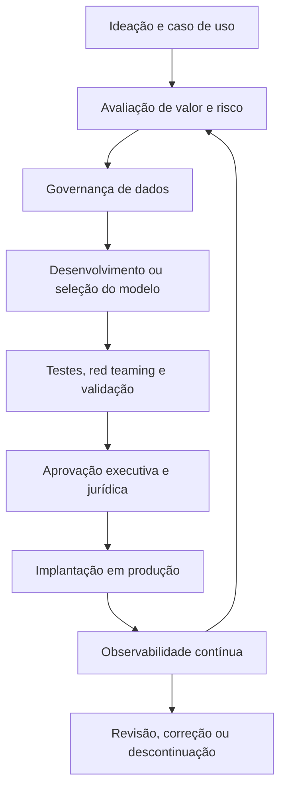

# Responsible AI

> **Resumo da disciplina**
> Diretrizes estratégicas e técnicas para a implementação de uma governança robusta e ética em Inteligência Artificial, traduzindo frameworks regulatórios em prática executiva, segurança jurídica e valor de negócio.

---

- [Responsible AI](#responsible-ai)
  - [1. Governança e Gestão de Dados — Fundamentos DAMA-DMBOK](#1-governança-e-gestão-de-dados--fundamentos-dama-dmbok)
    - [Diferenciação Estratégica: Gestão vs. Governança](#diferenciação-estratégica-gestão-vs-governança)
    - [As 6 Dimensões da Qualidade de Dados](#as-6-dimensões-da-qualidade-de-dados)
    - [Metadados e Linhagem](#metadados-e-linhagem)
    - [Data Mesh: Descentralização com Controle](#data-mesh-descentralização-com-controle)
      - [Características de um Produto de Dados](#características-de-um-produto-de-dados)
  - [2. Riscos e Princípios de IA Responsável](#2-riscos-e-princípios-de-ia-responsável)
    - [Definição de IA Responsável](#definição-de-ia-responsável)
    - [Taxonomia de Riscos e Accountability Gap](#taxonomia-de-riscos-e-accountability-gap)
      - [Accountability Gap](#accountability-gap)
    - [Casos de Estudo: Lições de Falha na Governança](#casos-de-estudo-lições-de-falha-na-governança)
  - [3. Governança, Frameworks e Regulação](#3-governança-frameworks-e-regulação)
    - [Novos Papéis na C-Level Suite](#novos-papéis-na-c-level-suite)
    - [Frameworks: Soft Law vs. Hard Law](#frameworks-soft-law-vs-hard-law)
  - [4. Mitigação de Riscos e Ciclo de Vida da IA](#4-mitigação-de-riscos-e-ciclo-de-vida-da-ia)
    - [Instrumentos de Segurança](#instrumentos-de-segurança)
      - [Ciclo de Vida Governado da IA](#ciclo-de-vida-governado-da-ia)
  - [5. Agentic AI e Gestão de Valor — ROI](#5-agentic-ai-e-gestão-de-valor--roi)
    - [O Pivot Estratégico: Value-based Consulting](#o-pivot-estratégico-value-based-consulting)
    - [Tokenomics: O Desafio de FinOps](#tokenomics-o-desafio-de-finops)
    - [Matriz de Priorização e Apetite de Risco](#matriz-de-priorização-e-apetite-de-risco)
      - [Matriz executiva simplificada](#matriz-executiva-simplificada)
    - [Alfabetização em IA — AI Literacy](#alfabetização-em-ia--ai-literacy)
  - [Síntese Executiva](#síntese-executiva)
  - [Glossário rápido](#glossário-rápido)

---

## 1. Governança e Gestão de Dados — Fundamentos DAMA-DMBOK

A robustez de qualquer sistema de IA é diretamente proporcional à qualidade da sua base de dados. Sem governança, a escala torna-se um risco operacional inaceitável.

### Diferenciação Estratégica: Gestão vs. Governança

De acordo com o **DAMA-DMBOK**, é necessário distinguir os níveis de atuação:

| Dimensão | Papel | Descrição |
|---|---|---|
| **Gestão de Dados** | Execução | Braço operacional que lida com extração, limpeza, transporte e refinamento. É a dimensão técnica que torna o dado utilizável. |
| **Governança de Dados** | Ordenação | Braço normativo. Define políticas, papéis, responsabilidades e regras de conformidade. Ordena a execução para garantir que o dado seja um ativo confiável. |

> **Ideia central:** a gestão executa; a governança define as regras, responsabilidades e limites da execução.

### As 6 Dimensões da Qualidade de Dados

Para o treinamento e uso de modelos de IA, a qualidade deve ser medida sob seis prismas fundamentais:

| Dimensão | Critério de qualidade |
|---|---|
| **Acurácia** | O dado reflete corretamente a realidade dos fatos. |
| **Completude** | Não há ausência relevante de campos ou registros que possam distorcer o aprendizado estatístico. |
| **Consistência** | A informação é uniforme entre diferentes sistemas, áreas e silos. |
| **Integridade** | As relações entre entidades de dados estão corretas e preservadas. |
| **Atualidade** | O dado está disponível no tempo correto para sua finalidade analítica ou operacional. |
| **Validade** | O dado respeita formatos, padrões e regras de negócio previamente definidos. |

### Metadados e Linhagem

A rastreabilidade exige a distinção entre diferentes tipos de metadados:

| Tipo de metadado | Conteúdo típico | Finalidade |
|---|---|---|
| **Metadados de Negócio** | Glossários, conceitos, semântica e definições corporativas. | Garantir entendimento comum entre áreas. |
| **Metadados Técnicos** | Estruturas de banco, campos, tipos, esquemas e integrações. | Permitir manutenção, arquitetura e interoperabilidade. |
| **Metadados Operacionais** | Logs, frequência de execução, qualidade de carga e histórico de processamento. | Apoiar monitoramento, auditoria e melhoria contínua. |

A **linhagem de dados** (*data lineage*) é o componente crítico para auditoria, permitindo rastrear o dado desde a origem bruta até seu consumo final em sistemas analíticos, modelos de IA e aplicações de negócio.

### Data Mesh: Descentralização com Controle

O **Data Mesh** resolve o gargalo da TI centralizada ao delegar a responsabilidade pelos dados aos domínios de negócio, como Marketing, Finanças, Operações ou Comercial.

Seus quatro pilares são:

1. **Propriedade por Domínio**
   Cada área de negócio assume responsabilidade pelos seus dados.

2. **Dados como Produto**
   O dado passa a ser tratado como ativo consumível, com dono, documentação, qualidade e finalidade clara.

3. **Plataforma Self-service**
   A organização oferece infraestrutura para que os domínios publiquem, acessem e consumam dados com autonomia.

4. **Governança Federada**
   As regras são comuns, mas a execução é distribuída entre os domínios.

#### Características de um Produto de Dados

| Característica | Descrição técnica |
|---|---|
| **Encontrável** | Registrado em um catálogo de dados ou marketplace interno. |
| **Endereçável** | Consumível por interfaces padrão, como APIs, SQL ou conectores. |
| **Confiável** | Possui SLAs de atualização, indicadores de qualidade e eventuais selos, como ouro/prata. |
| **Autodescritivo** | Documentação semântica suficiente para reduzir dependência de suporte técnico humano. |
| **Interoperável** | Modelagem permite cruzamento entre diferentes domínios. |
| **Seguro** | Controle de acesso nativo e conformidade com LGPD e políticas internas. |

---

## 2. Riscos e Princípios de IA Responsável

A confiança não é um conceito subjetivo. Em IA, ela funciona como base técnica, jurídica e reputacional para sair do piloto e avançar para produção em escala.

### Definição de IA Responsável

Segundo a Universidade de Stanford:

> IA Responsável é um conjunto de práticas e mecanismos de governança projetados para garantir que sistemas de IA sejam seguros, justos e benéficos, funcionando conforme o pretendido.

### Taxonomia de Riscos e Accountability Gap

Os riscos podem ser organizados em quatro grandes dimensões:

| Dimensão de risco | Exemplos |
|---|---|
| **Dados** | Acesso não autorizado, vazamento de PII (*Personally Identifiable Information*) e datasets enviesados. |
| **Modelo** | Alucinações, falta de explicabilidade, comportamento de caixa-preta e ataques de manipulação. |
| **Operacional** | Custos imprevisíveis de tokens, falhas de integração, dependência de fornecedores e perda de controle em escala. |
| **Ético/Legal** | Discriminação algorítmica, ausência de revisão humana, violação de direitos e lacunas de responsabilização. |

#### Accountability Gap

O **Accountability Gap** representa o risco de a organização tentar se eximir de responsabilidade alegando que uma decisão, erro ou dano foi causado autonomamente por um sistema de IA.

> **Princípio executivo:** a empresa continua responsável pelo comportamento dos sistemas que coloca em operação, mesmo quando há automação avançada.

### Casos de Estudo: Lições de Falha na Governança

| Caso | Falha observada | Lição de governança |
|---|---|---|
| **Air Canada** | Chatbot informou uma política de reembolso inexistente para tarifas de luto. | A organização pode ser responsabilizada pelos atos de seu agente computacional. |
| **Apple Card** | Alegações de viés algorítmico em concessão de crédito, com impacto discriminatório por gênero. | Modelos de decisão sensíveis exigem explicabilidade, auditoria e revisão humana. |
| **Lemonade** | Questionamentos sobre transparência no uso de expressões faciais e dados comportamentais em análise de sinistros. | IA em seguros e crédito exige clareza sobre critérios, limites e uso de dados pessoais. |

---

## 3. Governança, Frameworks e Regulação

A regulação de IA evoluiu de discussões éticas genéricas para exigências concretas de conformidade, documentação e responsabilização.

### Novos Papéis na C-Level Suite

Para evitar conflito entre velocidade de entrega e segurança, surgem papéis específicos de governança de IA:

- **Chief Responsible AI Officer — CRAIO**
  Responsável por princípios, políticas, avaliação ética, supervisão de riscos e alinhamento com valores corporativos.

- **Chief Governance AI Officer — CGAIO**
  Responsável por estruturas de governança, controles, documentação, auditoria e aderência regulatória.

> **Risco organizacional:** deixar a área que entrega IA ser a única responsável por aprovar seus próprios riscos cria conflito de interesse — o equivalente a deixar “o lobo cuidar do galinheiro”.

### Frameworks: Soft Law vs. Hard Law

| Framework ou norma | Tipo | Foco principal | Implicação executiva |
|---|---|---|---|
| **ISO 42001** | Soft Law | Sistema de Gestão de IA, com lógica PDCA. | Norma voluntária que pode certificar maturidade, processos e controles de IA. |
| **NIST AI RMF** | Soft Law | Mapear, medir, gerenciar e governar riscos de IA. | Referência prática para estruturar governança baseada em risco. |
| **EU AI Act** | Hard Law | Classificação de IA por risco: inaceitável, alto, limitado e mínimo. | Sistemas de alto risco, como RH e crédito, exigem controles severos, documentação e auditoria. |
| **PL 2338/2023 — Brasil** | Hard Law em tramitação | Direitos do cidadão à informação, explicação e revisão humana. | Empresas devem se preparar para deveres de transparência, explicabilidade e contestação. |
| **Resolução CFM 2.454/2024** | Regulação setorial | Uso de IA em medicina como ferramenta de apoio. | O médico mantém autonomia e responsabilidade final, reforçando o modelo *Human-in-the-Loop*. |

---

## 4. Mitigação de Riscos e Ciclo de Vida da IA

A governança operacional exige controles técnicos desde o desenho da solução até o monitoramento contínuo em produção.

### Instrumentos de Segurança

| Instrumento | Função | Risco mitigado |
|---|---|---|
| **Model Cards** | Fichas técnicas que detalham treinamento, limitações, bases utilizadas, métricas e níveis de acurácia. | Falta de transparência, uso indevido e dificuldade de auditoria. |
| **Red Teaming para IA** | Simulação de ataques, como *prompt injection*, extração de dados e manipulação de respostas. | Vulnerabilidades técnicas, abuso do sistema e falhas antes da escala. |
| **Observabilidade** | Monitoramento de desempenho, custo, logs, comportamento e *data drift*. | Perda de precisão, degradação em produção e custos não controlados. |
| **Privacy Enhancing Technologies — PETs** | Técnicas para processar dados mantendo privacidade, como anonimização, pseudonimização e computação segura. | Exposição indevida de dados, descumprimento da LGPD e riscos regulatórios. |

#### Ciclo de Vida Governado da IA

---

## 5. Agentic AI e Gestão de Valor — ROI

A governança deve funcionar como acelerador de valor, não como freio à inovação. O objetivo é permitir escala com controle.

### O Pivot Estratégico: Value-based Consulting

Empresas de consultoria como Accenture e Deloitte vêm migrando do modelo **labor-based**, baseado em horas/homem, para modelos **value-based**, baseados no valor gerado.

Com IA Agêntica, a produtividade humana pode aumentar de forma significativa, tornando menos aderente o faturamento baseado apenas em esforço físico ou cognitivo.

| Modelo | Base de cobrança | Limitação no contexto de IA |
|---|---|---|
| **Labor-based** | Horas, esforço e alocação de pessoas. | Penaliza ganhos de produtividade e escala automatizada. |
| **Value-based** | Valor gerado, impacto no negócio, eficiência ou receita incremental. | Exige medição clara de resultado, risco e contribuição da IA. |

### Tokenomics: O Desafio de FinOps

Diferentemente do Cloud FinOps tradicional, a **Tokenomics** — economia de tokens — é mais imprevisível.

Os principais fatores de risco são:

- expansão da janela de contexto;
- encadeamento de agentes;
- chamadas sucessivas a ferramentas externas;
- retrabalho automático;
- loops operacionais;
- ausência de limites de gasto em tempo real.

> **Risco prático:** sem monitoramento, agentes podem gerar custos exponenciais em segundos ou minutos, especialmente em fluxos autônomos e multiagentes.

### Matriz de Priorização e Apetite de Risco

A governança estratégica exige o mapeamento do **apetite de risco** da companhia. A priorização deve cruzar três dimensões:

1. **Valor de Negócio**
   Ganho de eficiência, receita, experiência do cliente, produtividade ou vantagem competitiva.

2. **Custo**
   Implementação, integração, licenciamento, infraestrutura, tokens e manutenção recorrente.

3. **Risco**
   Impacto regulatório, ético, reputacional, operacional e jurídico.

#### Matriz executiva simplificada

| Valor de negócio | Risco baixo | Risco alto |
|---|---|---|
| **Alto valor** | Priorizar e escalar com controles proporcionais. | Avaliar comitê, jurídico, testes reforçados e revisão humana. |
| **Baixo valor** | Automatizar apenas se o custo for baixo. | Evitar, postergar ou redesenhar o caso de uso. |

### Alfabetização em IA — AI Literacy

A última fronteira da governança é humana. A alfabetização em IA deve abranger desde o conselho de administração até equipes técnicas e áreas usuárias.

A organização precisa desenvolver competências em:

- entendimento básico de IA e suas limitações;
- leitura crítica de outputs;
- identificação de alucinações;
- proteção de dados sensíveis;
- uso responsável de ferramentas generativas;
- compreensão dos riscos de automação;
- cultura de revisão humana quando necessário.

---

## Síntese Executiva

A governança de IA não existe para travar a inovação. Sua função é criar condições para que a empresa acelere o uso da Inteligência Artificial com confiança, controle e responsabilidade.

Em termos executivos, a disciplina conecta cinco fundamentos:

1. **Dados governados** como base de confiabilidade.
2. **Riscos mapeados** antes da escala.
3. **Frameworks e regulações** traduzidos em controles práticos.
4. **Ciclo de vida monitorado** do desenho à operação.
5. **Valor de negócio mensurado** com apetite de risco explícito.

> **Frase-chave:** governança não é freio; é infraestrutura de confiança para escalar IA com responsabilidade.

---

## Glossário rápido

| Termo | Definição |
|---|---|
| **Accountability Gap** | Lacuna de responsabilização quando uma organização tenta atribuir a culpa por danos a um sistema autônomo. |
| **AI Literacy** | Alfabetização em IA; capacidade de compreender, usar e criticar sistemas de IA de forma responsável. |
| **Data Drift** | Mudança na distribuição dos dados ao longo do tempo, podendo degradar a performance do modelo. |
| **Data Mesh** | Modelo descentralizado de governança e gestão de dados baseado em domínios de negócio. |
| **Human-in-the-Loop** | Modelo em que uma pessoa participa da revisão, validação ou decisão final. |
| **Model Card** | Documento técnico que descreve características, limitações, métricas e usos adequados de um modelo. |
| **PII** | Informação pessoal identificável, como nome, CPF, endereço, e-mail ou telefone. |
| **Prompt Injection** | Ataque que tenta manipular instruções ou comportamento de um modelo por meio de comandos maliciosos. |
| **Tokenomics** | Gestão econômica do consumo de tokens em sistemas de IA generativa e agêntica. |
