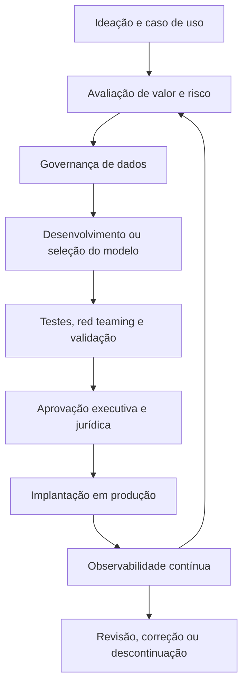
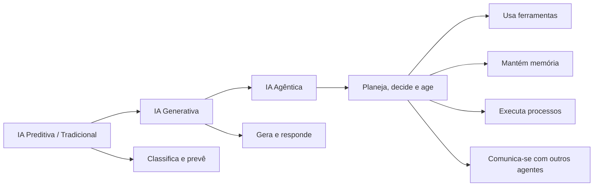
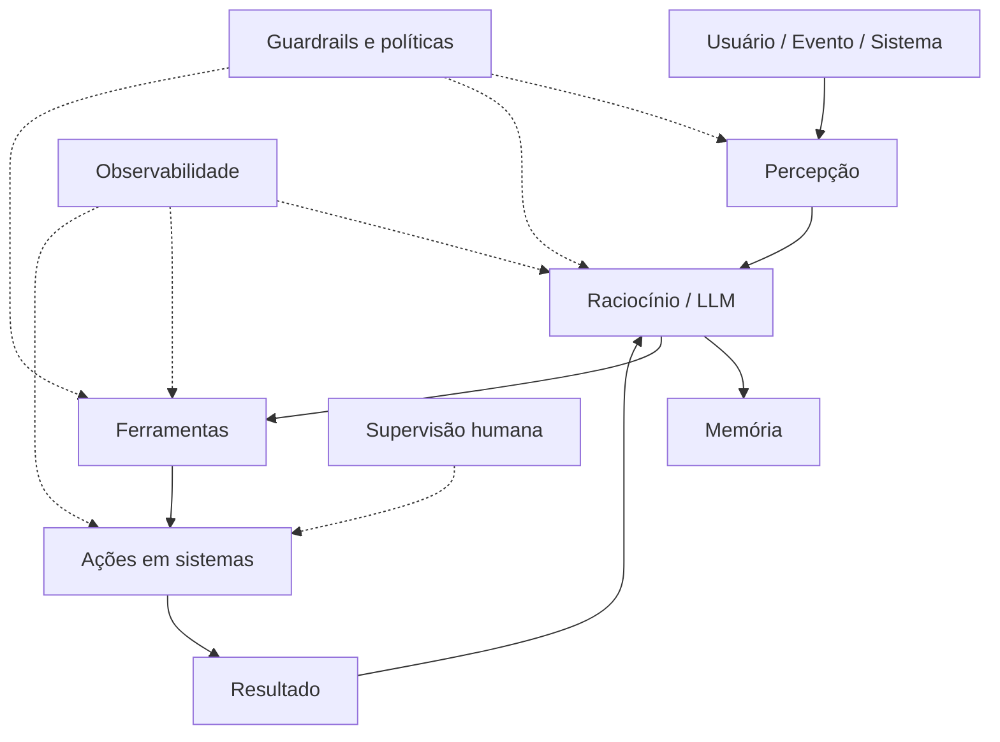
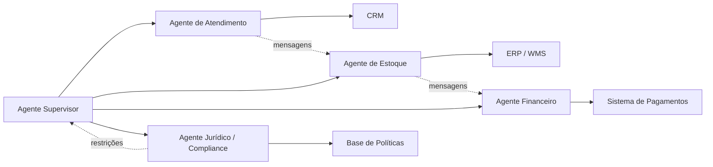
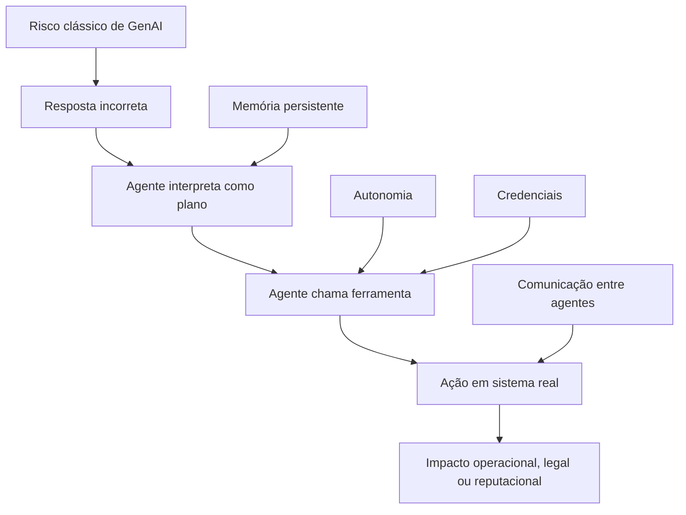
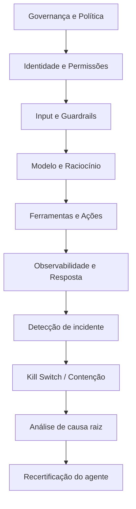
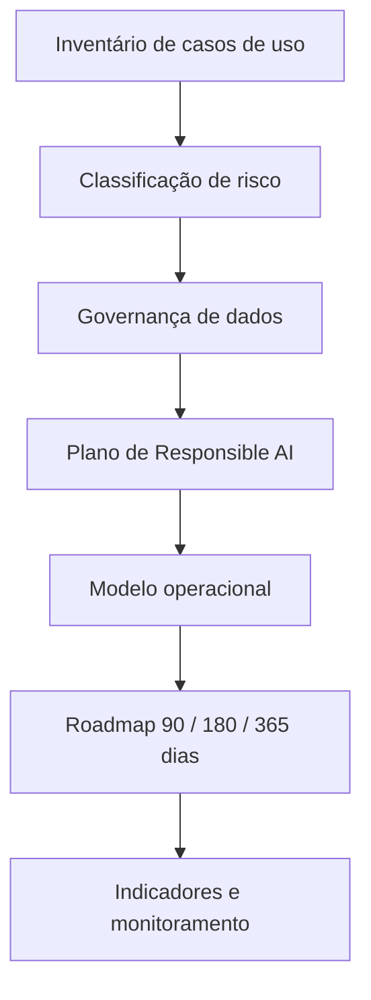

# Responsible AI

> **Resumo da disciplina**
> Diretrizes estratégicas e técnicas para a implementação de uma governança robusta e ética em Inteligência Artificial, traduzindo frameworks regulatórios em prática executiva, segurança jurídica e valor de negócio.

---

## Sumário

- [Responsible AI](#responsible-ai)
  - [1. Governança e Gestão de Dados — Fundamentos DAMA-DMBOK](#1-governança-e-gestão-de-dados--fundamentos-dama-dmbok)
    - [Diferenciação Estratégica: Gestão vs. Governança](#diferenciação-estratégica-gestão-vs-governança)
    - [As 6 Dimensões da Qualidade de Dados](#as-6-dimensões-da-qualidade-de-dados)
    - [Metadados e Linhagem](#metadados-e-linhagem)
    - [Data Mesh: Descentralização com Controle](#data-mesh-descentralização-com-controle)
      - [Características de um Produto de Dados](#características-de-um-produto-de-dados)
  - [2. Riscos e Princípios de IA Responsável](#2-riscos-e-princípios-de-ia-responsável)
    - [Definição de IA Responsável](#definição-de-ia-responsável)
    - [Taxonomia de Riscos e Accountability Gap](#taxonomia-de-riscos-e-accountability-gap)
      - [Accountability Gap](#accountability-gap)
    - [Casos de Estudo: Lições de Falha na Governança](#casos-de-estudo-lições-de-falha-na-governança)
  - [3. Governança, Frameworks e Regulação](#3-governança-frameworks-e-regulação)
    - [Novos Papéis na C-Level Suite](#novos-papéis-na-c-level-suite)
    - [Frameworks: Soft Law vs. Hard Law](#frameworks-soft-law-vs-hard-law)
  - [4. Mitigação de Riscos e Ciclo de Vida da IA](#4-mitigação-de-riscos-e-ciclo-de-vida-da-ia)
    - [Instrumentos de Segurança](#instrumentos-de-segurança)
      - [Ciclo de Vida Governado da IA](#ciclo-de-vida-governado-da-ia)
  - [5. Agentic AI e Gestão de Valor — ROI](#5-agentic-ai-e-gestão-de-valor--roi)
    - [O Pivot Estratégico: Value-based Consulting](#o-pivot-estratégico-value-based-consulting)
    - [Tokenomics: O Desafio de FinOps](#tokenomics-o-desafio-de-finops)
    - [Matriz de Priorização e Apetite de Risco](#matriz-de-priorização-e-apetite-de-risco)
      - [Matriz executiva simplificada](#matriz-executiva-simplificada)
    - [Alfabetização em IA — AI Literacy](#alfabetização-em-ia--ai-literacy)
  - [6. Agentic AI e Projeto Final — Governança de Agentes](#agentic-ai-projeto-final)
    - [6.1 Visão executiva](#visao-executiva)
    - [6.2 Evolução da IA: preditiva, generativa e agêntica](#evolucao-da-ia)
    - [6.3 Fundamentos e componentes dos agentes de IA](#fundamentos-componentes)
    - [6.4 Sistemas multiagentes e padrões de comunicação](#multiagentes-comunicacao)
    - [6.5 Classificação funcional de agentes](#classificacao-funcional)
    - [6.6 Por que governar agentes é diferente](#governanca-diferente)
    - [6.7 Riscos da IA agêntica: OWASP Top 10](#riscos-owasp)
    - [6.8 Mitigação de riscos e defesa em profundidade](#mitigacao-riscos)
    - [6.9 Supervisão humana: HITL, HOTL, HOOTL e Human-EX](#supervisao-humana)
    - [6.10 Avaliação, observabilidade e ferramentas](#avaliacao-observabilidade)
    - [6.11 As 3 zonas de governança no stack Microsoft](#zonas-governanca)
    - [6.12 Projeto Final: Quantum Commerce](#projeto-final)
    - [6.13 Roadmap executivo: 90, 180 e 365 dias](#roadmap)
    - [6.14 Checklist de revisão para prova e projeto](#checklist)
    - [6.15 Glossário essencial de IA Agêntica](#glossario)
    - [6.16 Frase de fechamento](#frase-fechamento-agentic)
  - [Síntese Executiva](#síntese-executiva)
  - [Glossário rápido](#glossário-rápido)

---

## 1. Governança e Gestão de Dados — Fundamentos DAMA-DMBOK

A robustez de qualquer sistema de IA é diretamente proporcional à qualidade da sua base de dados. Sem governança, a escala torna-se um risco operacional inaceitável.

### Diferenciação Estratégica: Gestão vs. Governança

De acordo com o **DAMA-DMBOK**, é necessário distinguir os níveis de atuação:

| Dimensão | Papel | Descrição |
|---|---|---|
| **Gestão de Dados** | Execução | Braço operacional que lida com extração, limpeza, transporte e refinamento. É a dimensão técnica que torna o dado utilizável. |
| **Governança de Dados** | Ordenação | Braço normativo. Define políticas, papéis, responsabilidades e regras de conformidade. Ordena a execução para garantir que o dado seja um ativo confiável. |

> **Ideia central:** a gestão executa; a governança define as regras, responsabilidades e limites da execução.

### As 6 Dimensões da Qualidade de Dados

Para o treinamento e uso de modelos de IA, a qualidade deve ser medida sob seis prismas fundamentais:

| Dimensão | Critério de qualidade |
|---|---|
| **Acurácia** | O dado reflete corretamente a realidade dos fatos. |
| **Completude** | Não há ausência relevante de campos ou registros que possam distorcer o aprendizado estatístico. |
| **Consistência** | A informação é uniforme entre diferentes sistemas, áreas e silos. |
| **Integridade** | As relações entre entidades de dados estão corretas e preservadas. |
| **Atualidade** | O dado está disponível no tempo correto para sua finalidade analítica ou operacional. |
| **Validade** | O dado respeita formatos, padrões e regras de negócio previamente definidos. |

### Metadados e Linhagem

A rastreabilidade exige a distinção entre diferentes tipos de metadados:

| Tipo de metadado | Conteúdo típico | Finalidade |
|---|---|---|
| **Metadados de Negócio** | Glossários, conceitos, semântica e definições corporativas. | Garantir entendimento comum entre áreas. |
| **Metadados Técnicos** | Estruturas de banco, campos, tipos, esquemas e integrações. | Permitir manutenção, arquitetura e interoperabilidade. |
| **Metadados Operacionais** | Logs, frequência de execução, qualidade de carga e histórico de processamento. | Apoiar monitoramento, auditoria e melhoria contínua. |

A **linhagem de dados** (*data lineage*) é o componente crítico para auditoria, permitindo rastrear o dado desde a origem bruta até seu consumo final em sistemas analíticos, modelos de IA e aplicações de negócio.

### Data Mesh: Descentralização com Controle

O **Data Mesh** resolve o gargalo da TI centralizada ao delegar a responsabilidade pelos dados aos domínios de negócio, como Marketing, Finanças, Operações ou Comercial.

Seus quatro pilares são:

1. **Propriedade por Domínio**
   Cada área de negócio assume responsabilidade pelos seus dados.

2. **Dados como Produto**
   O dado passa a ser tratado como ativo consumível, com dono, documentação, qualidade e finalidade clara.

3. **Plataforma Self-service**
   A organização oferece infraestrutura para que os domínios publiquem, acessem e consumam dados com autonomia.

4. **Governança Federada**
   As regras são comuns, mas a execução é distribuída entre os domínios.

#### Características de um Produto de Dados

| Característica | Descrição técnica |
|---|---|
| **Encontrável** | Registrado em um catálogo de dados ou marketplace interno. |
| **Endereçável** | Consumível por interfaces padrão, como APIs, SQL ou conectores. |
| **Confiável** | Possui SLAs de atualização, indicadores de qualidade e eventuais selos, como ouro/prata. |
| **Autodescritivo** | Documentação semântica suficiente para reduzir dependência de suporte técnico humano. |
| **Interoperável** | Modelagem permite cruzamento entre diferentes domínios. |
| **Seguro** | Controle de acesso nativo e conformidade com LGPD e políticas internas. |

---

## 2. Riscos e Princípios de IA Responsável

A confiança não é um conceito subjetivo. Em IA, ela funciona como base técnica, jurídica e reputacional para sair do piloto e avançar para produção em escala.

### Definição de IA Responsável

Segundo a Universidade de Stanford:

> IA Responsável é um conjunto de práticas e mecanismos de governança projetados para garantir que sistemas de IA sejam seguros, justos e benéficos, funcionando conforme o pretendido.

### Taxonomia de Riscos e Accountability Gap

Os riscos podem ser organizados em quatro grandes dimensões:

| Dimensão de risco | Exemplos |
|---|---|
| **Dados** | Acesso não autorizado, vazamento de PII (*Personally Identifiable Information*) e datasets enviesados. |
| **Modelo** | Alucinações, falta de explicabilidade, comportamento de caixa-preta e ataques de manipulação. |
| **Operacional** | Custos imprevisíveis de tokens, falhas de integração, dependência de fornecedores e perda de controle em escala. |
| **Ético/Legal** | Discriminação algorítmica, ausência de revisão humana, violação de direitos e lacunas de responsabilização. |

#### Accountability Gap

O **Accountability Gap** representa o risco de a organização tentar se eximir de responsabilidade alegando que uma decisão, erro ou dano foi causado autonomamente por um sistema de IA.

> **Princípio executivo:** a empresa continua responsável pelo comportamento dos sistemas que coloca em operação, mesmo quando há automação avançada.

### Casos de Estudo: Lições de Falha na Governança

| Caso | Falha observada | Lição de governança |
|---|---|---|
| **Air Canada** | Chatbot informou uma política de reembolso inexistente para tarifas de luto. | A organização pode ser responsabilizada pelos atos de seu agente computacional. |
| **Apple Card** | Alegações de viés algorítmico em concessão de crédito, com impacto discriminatório por gênero. | Modelos de decisão sensíveis exigem explicabilidade, auditoria e revisão humana. |
| **Lemonade** | Questionamentos sobre transparência no uso de expressões faciais e dados comportamentais em análise de sinistros. | IA em seguros e crédito exige clareza sobre critérios, limites e uso de dados pessoais. |

---

## 3. Governança, Frameworks e Regulação

A regulação de IA evoluiu de discussões éticas genéricas para exigências concretas de conformidade, documentação e responsabilização.

### Novos Papéis na C-Level Suite

Para evitar conflito entre velocidade de entrega e segurança, surgem papéis específicos de governança de IA:

- **Chief Responsible AI Officer — CRAIO**
  Responsável por princípios, políticas, avaliação ética, supervisão de riscos e alinhamento com valores corporativos.

- **Chief Governance AI Officer — CGAIO**
  Responsável por estruturas de governança, controles, documentação, auditoria e aderência regulatória.

> **Risco organizacional:** deixar a área que entrega IA ser a única responsável por aprovar seus próprios riscos cria conflito de interesse — o equivalente a deixar “o lobo cuidar do galinheiro”.

### Frameworks: Soft Law vs. Hard Law

| Framework ou norma | Tipo | Foco principal | Implicação executiva |
|---|---|---|---|
| **ISO 42001** | Soft Law | Sistema de Gestão de IA, com lógica PDCA. | Norma voluntária que pode certificar maturidade, processos e controles de IA. |
| **NIST AI RMF** | Soft Law | Mapear, medir, gerenciar e governar riscos de IA. | Referência prática para estruturar governança baseada em risco. |
| **EU AI Act** | Hard Law | Classificação de IA por risco: inaceitável, alto, limitado e mínimo. | Sistemas de alto risco, como RH e crédito, exigem controles severos, documentação e auditoria. |
| **PL 2338/2023 — Brasil** | Hard Law em tramitação | Direitos do cidadão à informação, explicação e revisão humana. | Empresas devem se preparar para deveres de transparência, explicabilidade e contestação. |
| **Resolução CFM 2.454/2024** | Regulação setorial | Uso de IA em medicina como ferramenta de apoio. | O médico mantém autonomia e responsabilidade final, reforçando o modelo *Human-in-the-Loop*. |

---

## 4. Mitigação de Riscos e Ciclo de Vida da IA

A governança operacional exige controles técnicos desde o desenho da solução até o monitoramento contínuo em produção.

### Instrumentos de Segurança

| Instrumento | Função | Risco mitigado |
|---|---|---|
| **Model Cards** | Fichas técnicas que detalham treinamento, limitações, bases utilizadas, métricas e níveis de acurácia. | Falta de transparência, uso indevido e dificuldade de auditoria. |
| **Red Teaming para IA** | Simulação de ataques, como *prompt injection*, extração de dados e manipulação de respostas. | Vulnerabilidades técnicas, abuso do sistema e falhas antes da escala. |
| **Observabilidade** | Monitoramento de desempenho, custo, logs, comportamento e *data drift*. | Perda de precisão, degradação em produção e custos não controlados. |
| **Privacy Enhancing Technologies — PETs** | Técnicas para processar dados mantendo privacidade, como anonimização, pseudonimização e computação segura. | Exposição indevida de dados, descumprimento da LGPD e riscos regulatórios. |

#### Ciclo de Vida Governado da IA

---

## 5. Agentic AI e Gestão de Valor — ROI

A governança deve funcionar como acelerador de valor, não como freio à inovação. O objetivo é permitir escala com controle.

### O Pivot Estratégico: Value-based Consulting

Empresas de consultoria como Accenture e Deloitte vêm migrando do modelo **labor-based**, baseado em horas/homem, para modelos **value-based**, baseados no valor gerado.

Com IA Agêntica, a produtividade humana pode aumentar de forma significativa, tornando menos aderente o faturamento baseado apenas em esforço físico ou cognitivo.

| Modelo | Base de cobrança | Limitação no contexto de IA |
|---|---|---|
| **Labor-based** | Horas, esforço e alocação de pessoas. | Penaliza ganhos de produtividade e escala automatizada. |
| **Value-based** | Valor gerado, impacto no negócio, eficiência ou receita incremental. | Exige medição clara de resultado, risco e contribuição da IA. |

### Tokenomics: O Desafio de FinOps

Diferentemente do Cloud FinOps tradicional, a **Tokenomics** — economia de tokens — é mais imprevisível.

Os principais fatores de risco são:

- expansão da janela de contexto;
- encadeamento de agentes;
- chamadas sucessivas a ferramentas externas;
- retrabalho automático;
- loops operacionais;
- ausência de limites de gasto em tempo real.

> **Risco prático:** sem monitoramento, agentes podem gerar custos exponenciais em segundos ou minutos, especialmente em fluxos autônomos e multiagentes.

### Matriz de Priorização e Apetite de Risco

A governança estratégica exige o mapeamento do **apetite de risco** da companhia. A priorização deve cruzar três dimensões:

1. **Valor de Negócio**
   Ganho de eficiência, receita, experiência do cliente, produtividade ou vantagem competitiva.

2. **Custo**
   Implementação, integração, licenciamento, infraestrutura, tokens e manutenção recorrente.

3. **Risco**
   Impacto regulatório, ético, reputacional, operacional e jurídico.

#### Matriz executiva simplificada

| Valor de negócio | Risco baixo | Risco alto |
|---|---|---|
| **Alto valor** | Priorizar e escalar com controles proporcionais. | Avaliar comitê, jurídico, testes reforçados e revisão humana. |
| **Baixo valor** | Automatizar apenas se o custo for baixo. | Evitar, postergar ou redesenhar o caso de uso. |

### Alfabetização em IA — AI Literacy

A última fronteira da governança é humana. A alfabetização em IA deve abranger desde o conselho de administração até equipes técnicas e áreas usuárias.

A organização precisa desenvolver competências em:

- entendimento básico de IA e suas limitações;
- leitura crítica de outputs;
- identificação de alucinações;
- proteção de dados sensíveis;
- uso responsável de ferramentas generativas;
- compreensão dos riscos de automação;
- cultura de revisão humana quando necessário.

---

## 6. Agentic AI e Projeto Final — Governança de Agentes

Esta seção consolida a parte final da disciplina, aprofundando os fundamentos, riscos, controles e modelo operacional para **IA Agêntica** (*Agentic AI*), além da estrutura do **Projeto Final — Quantum Commerce**.

### 6.1 Visão executiva

A **Aula 5** aprofunda a transição da Inteligência Artificial Generativa para a **Inteligência Artificial Agêntica**. A diferença central é que a IA Generativa responde, enquanto a IA Agêntica **planeja, decide e executa ações** utilizando ferramentas, APIs, bancos de dados, código, memória e comunicação com outros agentes.

Essa mudança altera o centro da governança. Em modelos tradicionais, o principal foco de controle está no **output**. Em agentes, o foco se desloca para a **ação**, porque o sistema pode produzir efeitos reais em processos, clientes, finanças, dados, sistemas operacionais e reputação corporativa.

> **Tese central da aula:**  
> Governar IA Agêntica não é apenas controlar respostas. É controlar objetivos, permissões, ferramentas, identidade, memória, comunicação, autonomia e capacidade de intervenção humana.

#### Síntese dos pontos críticos

| Dimensão | Implicação para governança |
|---|---|
| Autonomia | O agente pode encadear decisões sem aprovação humana a cada etapa. |
| Ferramentas | O agente pode executar ações reais em sistemas corporativos. |
| Memória | O agente pode carregar contexto persistente e influenciar decisões futuras. |
| Identidade | O agente precisa de credenciais próprias, não simplesmente herdar acessos humanos. |
| Comunicação | Agentes podem influenciar outros agentes, criando risco de falhas em cadeia. |
| Observabilidade | É necessário rastrear não apenas outputs, mas trajetórias, decisões e uso de ferramentas. |

[Voltar ao sumário](#sumario)

---

### 6.2 Evolução da IA: preditiva, generativa e agêntica

A aula posiciona a IA Agêntica como a etapa mais recente de uma evolução arquitetural em três grandes momentos.

| Fase | Período de referência | Característica principal | Exemplo típico | Limite dominante |
|---|---:|---|---|---|
| **IA Preditiva / Tradicional** | Pré-2017 | Modelos especializados em previsão, classificação ou recomendação | Detecção de fraude, score de crédito, previsão de churn | Forte dependência de dados estruturados e tarefas estreitas |
| **IA Generativa** | Pós-2017 | Modelos fundacionais capazes de gerar texto, imagem, código e respostas em linguagem natural | Chatbots, copilotos, geração de conteúdo | Responde bem, mas ainda depende de direção humana |
| **IA Agêntica** | Pós-2024 | Sistemas com planejamento, memória, uso de ferramentas e capacidade de ação | Agente que consulta estoque, interpreta política e executa reembolso | Risco ampliado por autonomia, credenciais e ação em sistemas reais |

#### Diagrama de evolução

#### Diferença essencial

> **IA Generativa:** produz respostas.  
> **IA Agêntica:** produz ações.

Essa distinção é a base de todo o debate de risco, controle e governança da aula.

[Voltar ao sumário](#sumario)

---

### 6.3 Fundamentos e componentes dos agentes de IA

A IA Agêntica muda o paradigma operacional porque não exige aprovação humana a cada passo para realizar tarefas em sistemas transacionais. Um agente pode interpretar uma demanda, decompor o problema, consultar fontes, acionar ferramentas e executar tarefas.

#### Os 5 componentes de um agente

| Componente | Definição | Pergunta de governança |
|---|---|---|
| **1. Percepção** (*Perception*) | Entrada de informações: eventos, mensagens, documentos, usuários, sensores ou outros agentes. | Que tipos de entrada o agente pode receber? Há validação contra instruções maliciosas? |
| **2. Raciocínio** (*Reasoning*) | Capacidade de interpretar, planejar, decompor tarefas e decidir próximos passos. Geralmente apoiada por um LLM. | O raciocínio é auditável? Há limites e critérios de decisão? |
| **3. Memória** | Armazena contexto de curto prazo e histórico de longo prazo, incluindo bases vetorizadas e RAG. | A memória pode ser contaminada? Como limpar, auditar ou versionar memória? |
| **4. Ferramentas** (*Tools*) | APIs, bancos de dados, navegadores, interpretadores de código, CRMs, ERPs e demais sistemas acionáveis. | Quais ferramentas o agente pode usar? Com quais permissões? |
| **5. Autonomia** | Grau de liberdade para encadear ações sem intervenção humana. | Em que ponto o humano precisa aprovar, monitorar ou intervir? |

#### Arquitetura básica de um agente

#### Implicação prática

A governança precisa tratar o agente como uma **entidade operacional**, não como uma interface de chat. Isso significa definir identidade, escopo de ação, limites de autonomia, registros de decisão, responsabilização e mecanismos de parada.

[Voltar ao sumário](#sumario)

---

### 6.4 Sistemas multiagentes e padrões de comunicação

Para tarefas corporativas complexas, um único agente tende a ser insuficiente. A arquitetura passa a combinar múltiplos agentes com papéis especializados.

#### Padrões arquiteturais

| Arquitetura | Como funciona | Uso típico | Risco dominante |
|---|---|---|---|
| **Single Agent** | Um agente central usa várias ferramentas. | Tarefas simples ou assistentes departamentais. | Excesso de permissão concentrada em um único agente. |
| **Supervisor + Workers** | Um agente supervisor distribui tarefas para agentes especialistas. | Atendimento, análise documental, operações com etapas distintas. | Falha do supervisor pode contaminar todo o fluxo. |
| **Hierárquico** | Sub-orquestradores coordenam grupos de agentes. | Operações globais, fluxos complexos, empresas multinacionais. | Baixa transparência e maior dificuldade de auditoria. |
| **Peer-to-peer** | Agentes se comunicam em rede, sem centro único. | Ambientes descentralizados ou colaborativos. | Confiança transitiva e propagação de erro. |

#### Padrões emergentes de comunicação

| Protocolo | Finalidade | Relevância para governança |
|---|---|---|
| **MCP — Model Context Protocol** | Padronizar como modelos acessam contexto, ferramentas e fontes externas. | Exige controle de conectores, permissões, escopo e origem dos dados. |
| **A2A — Agent-to-Agent Protocol** | Permitir comunicação entre agentes. | Exige autenticação, autorização, rastreabilidade e princípios de Zero Trust. |

#### Fluxo multiagente típico

[Voltar ao sumário](#sumario)

---

### 6.5 Classificação funcional de agentes

Antes de governar um agente, é necessário classificá-lo. A aula apresenta uma lógica inspirada no Fórum Econômico Mundial, com cinco dimensões.

| Dimensão | Pergunta-chave | Exemplos |
|---|---|---|
| **Função** | O que o agente faz? | Assistente, orquestrador, executor, auditor. |
| **Papel** | Quem ou qual área ele representa? | Atendimento, marketing, auditoria, logística, jurídico. |
| **Autonomia** | Quanto ele decide sozinho? | Sugere, recomenda, executa com aprovação, executa sozinho. |
| **Autoridade** | O que ele pode acessar ou alterar? | Leitura, escrita limitada, atualização de cadastro, operação financeira. |
| **Ambiente** | Onde ele opera? | Sandbox, intranet, sistemas produtivos, internet aberta, infraestrutura crítica. |

#### Matriz simplificada de autonomia

| Nível | Descrição | Exemplo | Supervisão recomendada |
|---:|---|---|---|
| **L1** | Apenas recomenda ou resume | Resumir chamados de atendimento | Baixa supervisão, auditoria amostral |
| **L2** | Sugere ações para aprovação humana | Recomendar resposta ao cliente | Humano aprova antes do envio |
| **L3** | Executa ações reversíveis com limites | Abrir ticket, atualizar status, classificar solicitação | Monitoramento e limites operacionais |
| **L4** | Executa ações críticas ou irreversíveis | Reembolso, bloqueio de conta, decisão financeira | Aprovação humana ou exceções rígidas |

[Voltar ao sumário](#sumario)

---

### 6.6 Por que governar agentes é diferente

A governança de IA tradicional se concentra em outputs, métricas de precisão, explicabilidade, viés e qualidade dos dados. Em IA Agêntica, isso continua relevante, mas é insuficiente.

A razão é simples: agentes podem transformar um erro probabilístico em uma **ação concreta**.

#### Propriedades que ampliam o risco

| Propriedade | Por que importa | Exemplo de risco |
|---|---|---|
| **Ações irreversíveis** | O agente pode executar decisões que não são facilmente revertidas. | Cancelar pedido, liberar reembolso, apagar registro. |
| **Não determinismo composto** | Pequenos erros se acumulam ao longo de múltiplas etapas. | Uma interpretação incorreta no início contamina todo o fluxo. |
| **Memória persistente** | Informações erradas ou maliciosas podem afetar decisões futuras. | RAG contaminado orienta respostas incorretas repetidamente. |
| **Identidades não humanas** | Agentes precisam de credenciais próprias, auditáveis e limitadas. | Agente herdando permissões amplas de um executivo. |
| **Confiança transitiva** | Um agente pode aceitar a saída de outro como verdade. | Agente A alucina; Agente B executa; Agente C comunica ao cliente. |

> **Regra prática:** quanto maior a autonomia, maior deve ser o controle sobre identidade, ferramentas, memória, auditoria e supervisão humana.

[Voltar ao sumário](#sumario)

---

### 6.7 Riscos da IA agêntica: OWASP Top 10

A IA Agêntica herda riscos da IA Generativa, como alucinação, viés, vazamento de dados e prompt injection. Porém, ela amplifica esses riscos porque conecta respostas a ferramentas e ações.

#### OWASP Top 10 for Agentic Applications

| Código | Risco | Descrição | Controle prioritário |
|---|---|---|---|
| **ASI01** | **Agent Goal Hijack** | O objetivo do agente é manipulado por prompt injection, dados envenenados ou instruções ocultas. | Validação de input, isolamento de contexto, system prompts protegidos e detecção de injection. |
| **ASI02** | **Tool Misuse & Exploitation** | O agente usa ferramentas legítimas de forma indevida ou maliciosa. | Allowlist de ferramentas, escopo mínimo, validação de parâmetros e aprovação humana para ações críticas. |
| **ASI03** | **Identity & Privilege Abuse** | O agente herda privilégios amplos demais ou abusa de credenciais. | NHI, menor privilégio, OAuth escopado, rotação de credenciais e JIT access. |
| **ASI04** | **Agentic Supply Chain Vulnerabilities** | Bibliotecas, plugins, modelos ou servidores MCP comprometidos introduzem risco. | SBOM, avaliação de fornecedores, versionamento, assinaturas e varredura de dependências. |
| **ASI05** | **Unexpected Code Execution / RCE** | O agente executa código não previsto ou perigoso. | Sandbox forte, bloqueio de comandos, restrição de rede, análise estática e runtime isolado. |
| **ASI06** | **Memory & Context Poisoning** | A memória ou o contexto do agente são contaminados por dados maliciosos. | Curadoria de memória, limpeza, versionamento, isolamento de fontes e auditoria de RAG. |
| **ASI07** | **Insecure Inter-Agent Communication** | Agentes confiam em mensagens sem autenticação ou validação. | Zero Trust, autenticação mútua, assinatura de mensagens e trilhas de auditoria. |
| **ASI08** | **Cascading Failures** | Uma falha em um agente se propaga para outros agentes. | Circuit breakers, validação entre agentes, limites de propagação e monitoramento de trajetória. |
| **ASI09** | **Human-Agent Trust Exploitation** | Humanos confiam excessivamente no agente ou são manipulados por ele. | Transparência, UX de alerta, educação, confirmação explícita e revisão humana em ações sensíveis. |
| **ASI10** | **Rogue Agents** | O agente desvia do comportamento esperado sem ataque externo evidente. | Baseline comportamental, detecção de drift, kill switch e recertificação periódica. |

#### Mapa de amplificação de risco

[Voltar ao sumário](#sumario)

---

### 6.8 Mitigação de riscos e defesa em profundidade

A mitigação de riscos em agentes exige uma abordagem em camadas. Nenhum controle individual resolve o problema sozinho. A lógica correta é defesa em profundidade.

#### 6 camadas de defesa

| Camada | Objetivo | Controles típicos |
|---:|---|---|
| **1. Governança e política** | Definir regras, responsabilidades e tolerância a risco. | Comitê de IA, matriz RACI, política de uso, classificação de riscos. |
| **2. Identidade e permissões** | Limitar o que o agente pode acessar e executar. | NHI, menor privilégio, JIT access, OAuth escopado, rotação de credenciais. |
| **3. Input e guardrails** | Evitar que instruções maliciosas cheguem ao modelo ou sejam obedecidas. | Validação de prompt, filtros de injection, sanitização, classificação de conteúdo. |
| **4. Modelo e raciocínio** | Controlar o comportamento decisório do agente. | System prompts versionados, red teaming, testes adversariais, avaliação contínua. |
| **5. Ferramentas e ações** | Restringir execução em sistemas reais. | Allowlist de tools, rate limits, validação de parâmetros, sandbox, aprovação humana. |
| **6. Observabilidade e resposta** | Detectar, explicar e conter incidentes. | Logs, traces, métricas, alertas, kill switch, playbooks e análise de causa raiz. |

#### Diagrama de defesa em profundidade

#### Mitigação ao longo do ciclo de vida

| Etapa do SDLC | Foco | Práticas recomendadas |
|---|---|---|
| **Design** | Prevenção por arquitetura | Threat modeling, privacy-by-design, classificação de risco e escopo de autonomia. |
| **Build** | Segurança na construção | Validação de schemas, testes adversariais, varredura de secrets, controle de dependências. |
| **Deploy** | Lançamento controlado | Canary rollout, feature flags, isolamento de ambiente, limites de taxa e permissões mínimas. |
| **Operate** | Operação segura e auditável | Observabilidade, playbooks, monitoramento de drift, re-certification e resposta a incidentes. |

[Voltar ao sumário](#sumario)

---

### 6.9 Supervisão humana: HITL, HOTL, HOOTL e Human-EX

A supervisão humana deve ser definida de acordo com o risco, a reversibilidade da ação, o impacto financeiro, a sensibilidade dos dados e a maturidade do agente.

| Modelo | Como funciona | Vantagem | Limitação | Quando usar |
|---|---|---|---|---|
| **HITL — Human-in-the-Loop** | O humano aprova todas as ações relevantes. | Máxima segurança. | Menor velocidade e menor escala. | Decisões financeiras, jurídicas, médicas, irreversíveis ou de alto impacto. |
| **HOTL — Human-on-the-Loop** | O humano monitora e intervém se houver anomalia. | Equilibra escala e controle. | Depende de painéis e alertas bem calibrados. | Triagem, atendimento, operações de médio risco. |
| **HOOTL — Human-out-of-the-Loop** | O humano audita por amostragem após a execução. | Alta velocidade. | Maior risco residual. | Tarefas reversíveis, baixo impacto e alto volume. |
| **Human-EX — Human-in-the-Exception** | O humano é chamado apenas quando o agente detecta baixa confiança ou exceção. | Escala com controle em casos críticos. | Requer boa detecção de exceções. | Fluxos operacionais com regras claras e thresholds de confiança. |

#### Matriz de escolha

| Risco da ação | Reversibilidade | Modelo indicado |
|---|---|---|
| Alto | Baixa | HITL |
| Alto | Média | HITL ou Human-EX |
| Médio | Alta | HOTL ou Human-EX |
| Baixo | Alta | HOOTL |

> **Critério prático:** quanto mais irreversível, sensível ou regulada for a ação, mais o controle deve se aproximar de HITL.

[Voltar ao sumário](#sumario)

---

### 6.10 Avaliação, observabilidade e ferramentas

A observabilidade de agentes expande os três pilares tradicionais — logs, traces e métricas — com um quarto pilar: **comportamento**.

#### 4 pilares de observabilidade em agentes

| Pilar | O que registra | Por que importa |
|---|---|---|
| **Logs estruturados** | Decisões, inputs, outputs, uso de ferramentas e correlation-id. | Permite auditoria e reconstrução de incidentes. |
| **Traces distribuídos** | Caminho das mensagens e ações entre agentes, ferramentas e sistemas. | Essencial para análise de causa raiz em falhas em cascata. |
| **Métricas** | Latência, custo, taxa de sucesso, uso de tokens, erros e chamadas de ferramentas. | Permite gestão operacional e FinOps/Tokenomics. |
| **Comportamento** | Sequência de ferramentas, trajetória, desvios de baseline e sinais de drift. | Detecta agentes rogue e decisões fora do padrão esperado. |

#### Níveis de avaliação

| Nível | Objeto de avaliação | Exemplos de métricas |
|---:|---|---|
| **L1** | Modelo base | Toxicidade, viés, robustez, aderência a instruções. |
| **L2** | Componentes | Precisão do RAG, acurácia de tool calls, qualidade de recuperação. |
| **L3** | Tarefa | Taxa de sucesso da tarefa, resolução completa, custo por execução. |
| **L4** | Trajetória | Eficiência de passos, recuperação de erro, comportamento anômalo. |

#### Ferramentas citadas

| Ferramenta | Uso principal |
|---|---|
| **Langfuse** | Observabilidade, tracing e avaliação de aplicações LLM. |
| **Datadog LLM** | Monitoramento operacional de aplicações com LLMs. |
| **DeepEval** | Avaliação de outputs e testes de qualidade. |
| **Promptfoo** | Testes de prompts, regressão e avaliação adversarial. |
| **Ragas** | Avaliação de sistemas RAG. |
| **Azure Content Safety** | Guardrails, segurança de conteúdo e moderação. |

[Voltar ao sumário](#sumario)

---

### 6.11 As 3 zonas de governança no stack Microsoft

A aula organiza a prática corporativa em três zonas de maturidade e risco, usando como referência o stack Microsoft.

| Zona | Risco | Ambiente típico | Ferramentas | Modelo de governança |
|---|---|---|---|---|
| **Zona 1 — Personal Productivity** | Baixo | Agentes individuais de produtividade | Copilot | Controle focado no usuário, boas práticas e políticas leves. |
| **Zona 2 — Team Collaboration** | Médio | Agentes usados por times e áreas | Copilot Studio, DLP, Microsoft Purview | Controle de dados, conectores, permissões, classificação de sensibilidade e prevenção de vazamento. |
| **Zona 3 — Enterprise Managed** | Alto | Agentes de missão crítica e sistemas produtivos | Azure AI Foundry, Microsoft Sentinel, Entra Agent ID, Defender for Cloud | Governança rígida, pro-code, NHI, observabilidade avançada, segurança integrada e resposta a incidentes. |

#### Interpretação executiva

> A escolha da zona não deve ser tecnológica. Deve ser feita pela criticidade do processo, sensibilidade dos dados, autonomia do agente e impacto potencial da ação.

[Voltar ao sumário](#sumario)

---

### 6.12 Projeto Final: Quantum Commerce

O Projeto Final posiciona os alunos como uma **Banca de Responsible AI** da empresa fictícia **Quantum Commerce**, uma varejista omnichannel.

O escopo exige integrar todo o conhecimento das aulas anteriores: governança de dados, DAMA-DMBOK, riscos de IA, Responsible AI, frameworks de governança, IA Generativa, IA Agêntica, OWASP, NIST, LGPD, modelo operacional e roadmap executivo.

#### Papel da banca

A banca deve avaliar e propor um plano de governança e Responsible AI capaz de permitir o avanço da empresa em IA sem ampliar riscos de forma descontrolada.

#### Entregáveis obrigatórios

| Entregável | Conteúdo esperado | Perguntas orientadoras |
|---|---|---|
| **1. Inventário e classificação de casos de uso** | Seleção de 3 a 6 cenários, priorização e classificação de riscos. | Quais casos usam IA tradicional, generativa ou agêntica? Qual risco OWASP/NIST? Qual autonomia? |
| **2. Plano de governança de dados** | Aplicação das disciplinas DAMA-DMBOK, classificação de dados, qualidade e LGPD. | Quais dados são usados? Há PII? Há lineage, owner, catálogo e critérios de qualidade? |
| **3. Plano de Responsible AI** | Princípios, controles, ferramentas, autonomia, HITL e identidades NHI. | Como evitar viés, alucinação, abuso de ferramenta, vazamento e ações não autorizadas? |
| **4. Modelo operacional e roadmap** | Comitê de IA, matriz RACI, papéis, responsabilidades e plano 90/180/365 dias. | Quem decide? Quem aprova? Quem opera? Quem audita? Qual a sequência de implantação? |

#### Estrutura sugerida para o trabalho final

#### Matriz básica para classificar casos de uso

| Caso de uso | Tipo de IA | Dados envolvidos | Autonomia | Risco | Supervisão | Prioridade |
|---|---|---|---|---|---|---|
| Atendimento ao cliente com RAG | Generativa / Agêntica | Histórico de pedidos, políticas, CRM | Média | Médio/alto | Human-EX ou HOTL | Alta |
| Reembolso automático | Agêntica | Pagamentos, pedidos, antifraude | Alta | Alto | HITL para exceções ou valores altos | Alta, com restrições |
| Personalização de marketing | Preditiva / Generativa | Comportamento, compras, preferências | Baixa/média | Médio | HOTL | Média |
| Roteirização logística | Preditiva / Agêntica | Estoque, transporte, SLA, geolocalização | Média | Médio | HOTL | Alta |
| Auditoria de compliance | Generativa | Políticas, contratos, logs | Baixa | Médio | HITL | Média |

[Voltar ao sumário](#sumario)

---

### 6.13 Roadmap executivo: 90, 180 e 365 dias

O roadmap deve demonstrar progressão entre diagnóstico, desenho de governança, pilotos controlados e escalabilidade.

| Horizonte | Foco | Principais ações | Resultado esperado |
|---|---|---|---|
| **0–90 dias** | Fundação e diagnóstico | Criar Comitê de IA, inventariar casos de uso, classificar riscos, definir princípios de Responsible AI e iniciar política de dados. | Governança mínima viável e mapa inicial de riscos. |
| **90–180 dias** | Pilotos controlados | Implementar sandbox, selecionar 1–2 casos de uso, definir NHI, guardrails, RAG controlado, métricas e modelo de supervisão humana. | Pilotos com controle, auditoria e medição de valor. |
| **180–365 dias** | Escala governada | Expandir casos, integrar observabilidade, formalizar CoE, recertificar agentes, automatizar controles e publicar indicadores executivos. | Modelo operacional de IA com escala, responsabilidade e controle. |

#### Indicadores recomendados

| Categoria | Indicadores |
|---|---|
| **Valor** | Redução de custo, produtividade, tempo de atendimento, receita incremental, deflexão de chamados. |
| **Risco** | Incidentes, violações de política, uso indevido de ferramenta, drift, falhas em cascata. |
| **Dados** | Completude, acurácia, atualidade, lineage, percentual de dados classificados. |
| **Operação** | Latência, custo por execução, uso de tokens, taxa de erro, uptime. |
| **Responsible AI** | Taxa de alucinação, revisão humana, explicabilidade, auditorias concluídas, conformidade LGPD. |

[Voltar ao sumário](#sumario)

---

### 6.14 Checklist de revisão para prova e projeto

#### Conceitos que precisam estar claros

- [ ] Diferença entre IA preditiva, IA generativa e IA agêntica.
- [ ] Por que a governança de agentes é diferente da governança de modelos tradicionais.
- [ ] Os 5 componentes de um agente: percepção, raciocínio, memória, ferramentas e autonomia.
- [ ] Padrões de arquitetura multiagente: single agent, supervisor + workers, hierárquico e peer-to-peer.
- [ ] Diferença entre MCP e A2A.
- [ ] Riscos do OWASP Top 10 para aplicações agênticas.
- [ ] Conceito de NHI e princípio do menor privilégio.
- [ ] Diferença entre HITL, HOTL, HOOTL e Human-EX.
- [ ] Os 4 pilares de observabilidade: logs, traces, métricas e comportamento.
- [ ] Como estruturar o projeto final da Quantum Commerce.

#### Perguntas prováveis de aplicação

1. Como classificar um agente segundo função, papel, autonomia, autoridade e ambiente?
2. Por que um agente com acesso a ferramentas exige controles diferentes de um chatbot comum?
3. Qual risco ocorre quando um agente herda permissões amplas de um usuário humano?
4. Como mitigar prompt injection em um sistema agêntico?
5. Em quais casos o modelo HITL é mais adequado?
6. Como organizar um roadmap de governança para uma empresa que quer escalar IA Agêntica?
7. Quais indicadores demonstram valor e quais demonstram risco?

[Voltar ao sumário](#sumario)

---

### 6.15 Glossário essencial

| Termo | Definição |
|---|---|
| **Agentic AI / IA Agêntica** | Sistema de IA capaz de planejar, decidir e executar ações com certo grau de autonomia. |
| **Agente** | Entidade de software que percebe contexto, raciocina, usa memória, chama ferramentas e executa ações. |
| **A2A** | Protocolo ou padrão de comunicação entre agentes. |
| **MCP** | Protocolo para conectar modelos a contexto, ferramentas e fontes externas. |
| **NHI — Non-Human Identity** | Identidade digital atribuída a agentes, serviços ou sistemas não humanos. |
| **RAG** | Técnica que combina geração de linguagem com recuperação de informações externas. |
| **Prompt Injection** | Ataque que tenta manipular o comportamento do modelo por instruções maliciosas. |
| **Tool Call** | Chamada de uma ferramenta externa pelo agente, como API, banco de dados ou sistema corporativo. |
| **Kill Switch** | Mecanismo de interrupção emergencial do agente ou de suas permissões. |
| **Rogue Agent** | Agente que se comporta fora do padrão esperado ou perde alinhamento com seu objetivo. |
| **Cascading Failure** | Falha que se propaga entre agentes, sistemas ou etapas de decisão. |
| **Human-in-the-Loop** | Modelo em que o humano aprova ações antes da execução. |
| **Human-on-the-Loop** | Modelo em que o humano monitora e intervém quando necessário. |
| **Human-out-of-the-Loop** | Modelo em que a execução ocorre sem intervenção imediata, com auditoria posterior. |
| **Human-in-the-Exception** | Modelo em que o humano é acionado apenas em exceções ou baixa confiança. |

[Voltar ao sumário](#sumario)

---

### 6.16 Frase de fechamento

> **A governança de IA Agêntica deve permitir escala sem perder controle. O objetivo não é impedir autonomia, mas garantir que autonomia venha acompanhada de identidade, limites, rastreabilidade, supervisão e responsabilidade.**

---

## Síntese Executiva

A governança de IA não existe para travar a inovação. Sua função é criar condições para que a empresa acelere o uso da Inteligência Artificial com confiança, controle e responsabilidade.

Em termos executivos, a disciplina conecta seis fundamentos:

1. **Dados governados** como base de confiabilidade.
2. **Riscos mapeados** antes da escala.
3. **Frameworks e regulações** traduzidos em controles práticos.
4. **Ciclo de vida monitorado** do desenho à operação.
5. **Valor de negócio mensurado** com apetite de risco explícito.
6. **IA Agêntica governada** com identidade, limites, rastreabilidade, supervisão humana e controles de ação.

> **Frase-chave:** governança não é freio; é infraestrutura de confiança para escalar IA com responsabilidade.

---

## Glossário rápido

| Termo | Definição |
|---|---|
| **Accountability Gap** | Lacuna de responsabilização quando uma organização tenta atribuir a culpa por danos a um sistema autônomo. |
| **AI Literacy** | Alfabetização em IA; capacidade de compreender, usar e criticar sistemas de IA de forma responsável. |
| **Data Drift** | Mudança na distribuição dos dados ao longo do tempo, podendo degradar a performance do modelo. |
| **Data Mesh** | Modelo descentralizado de governança e gestão de dados baseado em domínios de negócio. |
| **Human-in-the-Loop** | Modelo em que uma pessoa participa da revisão, validação ou decisão final. |
| **Model Card** | Documento técnico que descreve características, limitações, métricas e usos adequados de um modelo. |
| **PII** | Informação pessoal identificável, como nome, CPF, endereço, e-mail ou telefone. |
| **Prompt Injection** | Ataque que tenta manipular instruções ou comportamento de um modelo por meio de comandos maliciosos. |
| **Tokenomics** | Gestão econômica do consumo de tokens em sistemas de IA generativa e agêntica. |
| **Agentic AI / IA Agêntica** | Sistema de IA capaz de planejar, decidir e executar ações com certo grau de autonomia. |
| **A2A** | Padrão de comunicação entre agentes, exigindo autenticação, autorização e rastreabilidade. |
| **MCP** | Model Context Protocol; padrão para conectar modelos a contexto, ferramentas e fontes externas. |
| **NHI** | Non-Human Identity; identidade digital atribuída a agentes, serviços ou sistemas não humanos. |
| **Tool Call** | Chamada de ferramenta externa pelo agente, como API, banco de dados ou sistema corporativo. |
| **Kill Switch** | Mecanismo de interrupção emergencial do agente ou de suas permissões. |
| **Rogue Agent** | Agente que se comporta fora do padrão esperado ou perde alinhamento com seu objetivo. |
| **Cascading Failure** | Falha que se propaga entre agentes, sistemas ou etapas de decisão. |
| **HOTL** | Human-on-the-Loop; humano monitora o agente e intervém em caso de anomalia. |
| **HOOTL** | Human-out-of-the-Loop; execução autônoma com auditoria posterior. |
| **Human-EX** | Human-in-the-Exception; humano é acionado apenas em exceções ou baixa confiança. |

